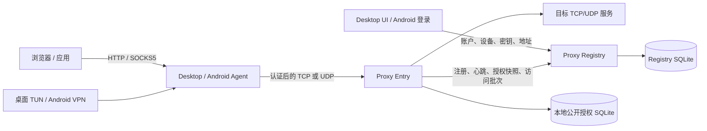

# PPAASS

PPAASS 是一个以 Rust 实现的受管加密代理系统。它提供桌面和 Android Agent、本地
HTTP/SOCKS5/TUN/VPN 入口、Proxy Entry 数据面，以及用于账户、设备、密钥审批、授权和
Entry 目录的 Proxy Registry 控制面。

TCP 目标始终使用独立的 framed PPAASS TCP 连接；代理 UDP 可选择原生认证加密 UDP、
TCP/Yamux，或在原生 UDP 控制连接超时时按 session slot 自动回退到 TCP/Yamux。Proxy
Entry 负责认证与目标中继，Proxy Registry 不承载代理数据。

## 文档导航

| 文档 | 内容 |
| --- | --- |
| [功能需求与现有能力](docs/REQUIREMENTS.md) | 当前可用功能、用户与管理员能力、代理、TUN、平台和部署范围 |
| [本地搭建指南](docs/SETUP.md) | 本机 Registry、Entry、Desktop UI、TUN 权限与连接验证 |
| [项目摘要](docs/SUMMARY.md) | 当前组件、边界、关键技术与开发/发布入口的简明概览 |
| [技术架构与实现细节](docs/TECHNICAL_DETAILS.md) | crate 架构、协议、关键技术与算法、时序图、SQLite 表结构与 ER 图 |
| [项目学习导览](docs/PROJECT_WALKTHROUGH.md) | 从入口流量到控制面、转发、TUN、桌面/Android、测试和部署的 Mermaid 流程图导览 |
| [测试指南](docs/TESTING.md) | CI 矩阵、本地验证、集成测试、性能/QUIC 测试和 Android 测试 |
| [GitHub Actions 部署](docs/GITHUB_ACTIONS_DEPLOYMENT.md) | Environment 配置、Secrets/Variables、构建发布、Caddy、Entry 扩缩容、验收与回滚边界 |
| [安全策略](docs/SECURITY.md) | 支持版本与安全问题报告策略 |

子项目的专用说明：

- [Proxy Registry 本地开发与 API](proxy-registry/README.md)
- [Android Agent](android-agent/README.md)
- [集成与性能测试工具](tests/README.md)

历史测试基线：

- [最高吞吐历史基线与复测说明](docs/MAX_THROUGHPUT_REPORT.md)

## 核心能力

- 本地 HTTP、HTTPS CONNECT、SOCKS5 CONNECT/BIND，以及桌面 SOCKS5 UDP ASSOCIATE。
- 桌面 TUN 与 Android `VpnService`，支持 TCP、UDP、代理 DNS、direct-access 规则与
  应用层 QUIC 策略。
- 管理端账户注册/登录、设备授权、密钥申请和审批、用户与管理员权限、Proxy Entry 选择。
- 每用户的 RSA 身份认证；framed TCP/TCP-Yamux 与原生 UDP 分别使用对应的安全状态机。
- 原生 UDP 使用 RSA 身份证明、RSA 保护的 session secret、HKDF 双向密钥派生、
  AES-256-GCM、AAD、序号防重放及有界分片/重组。
- Registry 作为权威数据源；Entry 通过受 Token 保护的 HTTP/SSE 控制面原子同步公开
  授权快照，并以幂等批次回传访问记录。
- Registry 可由 Caddy 代理为双实例；Entry 可按单机 `1–100` 个实例扩缩容。

## 架构概览



完整的分支、状态机、认证时序和部署拓扑见
[项目学习导览](docs/PROJECT_WALKTHROUGH.md) 与
[技术架构与实现细节](docs/TECHNICAL_DETAILS.md)。

## 快速开始：开发环境

### 前置条件

- Rust `1.98.1`（与主要 CI 和发布工作流一致）。
- C/C++ 构建工具、`pkg-config` 和 OpenSSL 开发库。
- Registry 前端需要 Node.js `24`；桌面 UI 在 CI 使用 Node.js `22`。
- Android 构建还需要 JDK 17、Android Platform 35、Build Tools 35.0.0 和 NDK
  `28.2.13676358`，详见[测试指南](docs/TESTING.md#6-android-本地验证)。

### 构建核心 workspace

```bash
# 以锁定依赖构建全部 Rust crate
cargo build --workspace --all-targets --release --locked

# 单独构建数据面与控制面
cargo build -p proxy-entry --release --locked
cargo build -p proxy-registry --release --locked

# 构建 Registry 管理前端
cd proxy-registry/frontend
npm ci --no-audit --no-fund
npm run build
```

### 启动本地 Registry

首次启动空数据库时，Registry 使用环境变量创建固定用户名 `admin` 的管理员账号。密钥
加密主密钥和 Control Token 都必须至少 32 字节；主密钥一旦用于生产数据库，之后必须保持
完全一致。

```bash
export PPAASS_PROXY_REGISTRY_BOOTSTRAP_ADMIN_PASSWORD='replace-with-a-strong-password'
export PPAASS_PROXY_REGISTRY_KEY_ENCRYPTION_SECRET='replace-with-at-least-32-random-bytes'
export PPAASS_PROXY_REGISTRY_CONTROL_TOKEN='replace-with-at-least-32-random-bytes'

cargo run -p proxy-registry
```

本地开发、前端热更新、API 和管理员流程见
[Proxy Registry 文档](proxy-registry/README.md)。生产环境不要把这些秘密写入仓库、配置
文件或命令行历史；应采用受控的 Secret 管理方式。

### 启动 Proxy Entry 与 Desktop UI

先为 Entry 准备有效的 `registry_url`、Control Token 文件、稳定 `entry_id`、公告地址和
本地授权 SQLite 路径；可从 [`config/proxy-entry.toml`](config/proxy-entry.toml) 开始。Entry
在启动后向 Registry 注册，并同步公开授权快照。

```bash
cargo run -p proxy-entry -- --config config/proxy-entry.toml

# 另一个终端：启动 Desktop Tauri 应用并在 UI 中登录
cd desktop-agent-ui
npm ci
npm run tauri dev
```

生产 Agent 从登录后的受管 profile 取得用户名、私钥和 Entry 地址。产品 `desktop-agent`
命令行不会接受旧的公开 Proxy 地址参数；需要固定地址的端到端测试必须使用测试专用
`desktop-agent-integration-harness`，参见[测试指南](docs/TESTING.md#4-本地端到端测试)。

## 配置要点

[`config/agent.toml`](config/agent.toml) 包含桌面 Agent 的本地配置；用户名、私钥路径和
Proxy 地址由登录后的受管 profile 提供，不应手工把生产私钥提交到仓库。

| 配置 | 说明 |
| --- | --- |
| `listen_addr` | 本地 HTTP/SOCKS5 监听地址；示例配置为 `0.0.0.0:10080`。 |
| `proxy_registry_url` | Registry 登录地址；回环地址可用 HTTP，远程地址应使用 HTTPS。 |
| `transport_mode` | `udp` 为原生加密 UDP，`tcp` 为 TCP/Yamux，`auto` 为每个 UDP session slot 从原生 UDP 自动回退 TCP/Yamux；TCP 目标始终是 direct framed TCP。 |
| `udp_session_pool_size` | 原生 UDP/`auto` 的 session 数，范围 `1–8`；`tcp` 模式不使用它。 |
| `compression_mode` | `none`、`lz4`、`gzip`、`zstd`；仅用于 framed TCP/TCP-Yamux，不压缩原生 UDP 数据报。 |
| `[tun]`、`[direct_access]` | 分别控制 TUN、代理 DNS/UDP/QUIC，以及绕过代理的域名/IP/CIDR 规则。 |

`transport_mode = "quic"` 和 `quic_connection_pool_size` 已移除，会被明确拒绝；应迁移为
`udp`、`tcp` 或 `auto`，并使用 `udp_session_pool_size`。

Proxy Entry 的主要配置为：

| 配置 | 说明 |
| --- | --- |
| `listen_addr` | 同一数值端口同时监听 TCP 与原生 UDP；生产防火墙必须同时开放两种协议。 |
| `entry_id` / `advertised_address` | 稳定的 Entry 身份和下发给 Agent 的公网 `host:port`。 |
| `registry_url` / `registry_control_token_path` | Registry 根 URL 与控制面 Bearer Token 文件。 |
| `authorization_database_path` | Entry 的公开授权快照 SQLite；不是 Registry 权威数据库。 |
| `outbound_interface` | 空值使用系统默认路由；可指定网卡或使用 `auto` 选择原始物理出口。 |

更完整的配置、授权同步、数据库和安全边界见
[技术架构与实现细节](docs/TECHNICAL_DETAILS.md)。

## 测试与质量检查

在提交 Rust、脚本、部署或前端改动前，至少运行：

```bash
./scripts/check-source-line-limits.sh
bash ./scripts/test-proxy-deployment-layout.sh
cargo test --workspace --locked
```

端到端测试需要启动 mock target、Proxy Entry 和测试专用 Agent harness。性能工具还可以测量
TCP、UDP、QUIC、Range 下载和最大吞吐，并生成 HTML、JSON、Markdown 报告。完整命令、端口
和 CI 覆盖范围见[测试指南](docs/TESTING.md)。

## 生产部署

生产发布由两个手动 GitHub Actions 工作流完成：

- `deploy-proxy-registry.yml`：构建 Registry/前端，在 `registry_production` Environment
  部署两个 Registry 实例和 Caddy。
- `deploy-proxy-entry.yml`：构建 Proxy Entry，在 `entry_production` Environment 部署
  `1–100` 个数据面实例、systemd 模板单元和本地授权副本。

两个工作流使用独立的 Secrets/Variables；Entry 与 Registry 可分机或同机部署。具体的
Environment 名称、必填 Secret、Caddy 健康检查、端口/防火墙、发布保留和回滚限制见
[GitHub Actions 部署文档](docs/GITHUB_ACTIONS_DEPLOYMENT.md)。

## 安全边界

- 用户私钥只由受控 Agent 原生后端领取与保存，不能返回给 Vue WebView 或写入日志。
- Registry 负责账户、设备、私钥托管、访问审计和权威授权；Entry 只持有可用于认证的公开
  快照，并在首个完整快照前拒绝认证。
- 原生 UDP 使用独立 AEAD 数据报、序号和重放窗口，不提供可靠有序语义；TCP 可靠性由其
  固有的流语义提供。
- HTTPS、操作系统凭据权限、主机防火墙、云安全组和 GitHub Environment 保护共同构成
  生产防线；部署的具体边界见[部署文档](docs/GITHUB_ACTIONS_DEPLOYMENT.md)。

## 仓库结构

```text
ppaass-ai/
├── desktop-agent-be/       # 桌面 Agent 后端
├── desktop-agent-ui/       # Tauri 2 + Vue 桌面应用
├── android-agent/          # Android VpnService 与 Rust native Agent
├── proxy-entry/            # 代理数据面、认证、目标 relay、授权副本
├── proxy-registry/         # 控制面、SQLite、API、管理前端
├── proxy-control-protocol/ # Registry ↔ Entry 控制面协议
├── protocol/               # Agent ↔ Entry 传输协议与加密
├── common/                 # 复用连接、传输选择与工具
├── tests/                  # 集成/性能测试工具
├── config/                 # 示例与部署配置模板
├── deploy/                 # Registry/Entry 远端安装器
├── docs/                   # 本 README 链接的项目文档
└── .github/workflows/      # CI、扫描与手动部署工作流
```

## License

MIT
