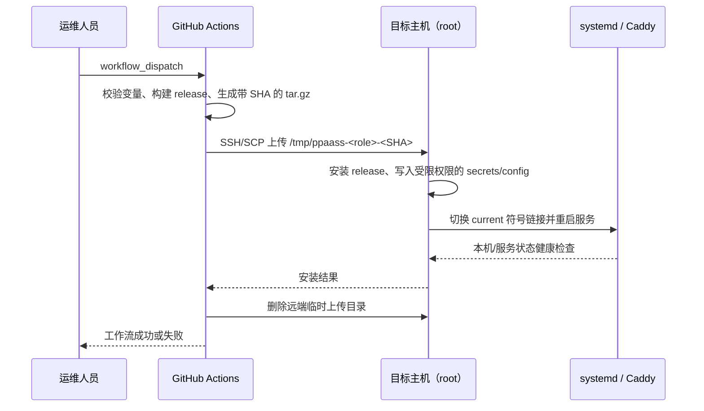
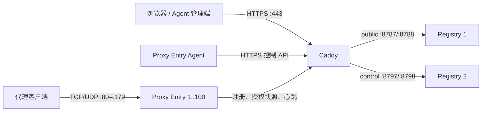

# GitHub Actions 部署流程与实现方案

本文档描述仓库当前用于生产发布的 GitHub Actions 工作流、部署拓扑、运行时布局和
验收边界。它以工作流及安装脚本的实际行为为准：

- Registry：[`.github/workflows/deploy-proxy-registry.yml`](../.github/workflows/deploy-proxy-registry.yml)
- Entry：[`.github/workflows/deploy-proxy-entry.yml`](../.github/workflows/deploy-proxy-entry.yml)
- Registry 安装器：[`deploy/proxy-registry/install.sh`](../deploy/proxy-registry/install.sh)
- Entry 安装器：[`deploy/proxy-entry/install.sh`](../deploy/proxy-entry/install.sh)

这两个工作流只允许手动触发，分别使用独立的 GitHub Environment，因此可以部署到
不同机器，也支持同机部署。

## 1. 发布模型

| 工作流 | GitHub Environment | 发布对象 | 触发参数 |
| --- | --- | --- | --- |
| `deploy-proxy-registry.yml` | `registry_production` | Registry 二实例、前端和 Caddy 反向代理 | 环境 |
| `deploy-proxy-entry.yml` | `entry_production` | 一个或多个 Proxy Entry 实例 | 环境、`instance_count`（1–100，默认 1） |

两条工作流都具备 `contents: read` 的最小仓库权限，并按目标 Environment 串行执行
（不取消已经开始的发布）。发布包在 GitHub 托管 Runner 的 Debian Bookworm 容器中构建，
再通过 SSH/SCP 发送到远端的临时目录，由远端 root 安装器完成切换。



> 部署工作流会做发布所需的输入校验、脚本语法检查和 release 构建；不会重复执行
> Rust/前端单元测试或部署契约测试。这些质量检查应由独立 CI 工作流在合并前完成。

## 2. 构建与传输实现

### 2.1 Registry 工作流

Registry 工作流使用 Rust `1.98.0` 和 Node.js `24`，依次执行：

1. 对启动脚本和 Registry 安装器执行 `bash -n`。
2. 运行 `npm ci --prefix proxy-registry/frontend --no-audit --no-fund` 与前端构建。
3. 执行 `cargo build -p proxy-registry --release`。
4. 将二进制、启动脚本、安装器、前端 `dist/`、`deploy.env` 和三个秘密文件打包。
5. 使用密码 SSH 上传，并在远端执行 `install.sh`。

包中的秘密文件为管理员初始密码、Registry 密钥加密主密钥和 Control Token；它们不会作为
命令行参数传入。`deploy.env` 只包含版本 SHA、Registry 公网主机名和运行时根目录等非秘密
配置。

### 2.2 Entry 工作流

Entry 工作流使用 Rust `1.98.0`，并先对安装、实例布局、防火墙和 Registry URL 校验脚本
执行 `bash -n`。随后构建 `proxy-entry` release，并将以下内容打包：二进制、安装及辅助
脚本、配置模板、Control Token 和 `deploy.env`。

工作流在上传前校验 Entry ID、公告地址、Registry URL、实例数、运行时根目录及 Token。
Registry URL 必须是根路径 HTTP/HTTPS URL：不允许用户名密码、额外路径、查询参数或
fragment。

### 2.3 SSH 边界

当前实现使用 `sshpass` 的密码认证，显式关闭客户端公钥认证；首次连接时自动接受目标机
主机指纹。该方案便于 GitHub Environment 保存独立凭据，但也意味着：

- `REMOTE_PASSWORD` 必须是专用高强度密码，且不得包含换行；应定期轮换。
- Environment 必须限制可触发部署的分支、审批人和维护者。
- 目标地址必须由受信运维人员配置；首次指纹自动接受不适合不可信网络中的人工跳板场景。
- 远端用户当前必须为 `root`（UID 0）；安装器不会调用 `sudo`。

## 3. 生产拓扑与端口



Registry 的两个进程使用同一份用户、访问记录和密钥持久化数据，但监听不同的本地回环端口：

| 流量 | Registry 1 | Registry 2 | Caddy 对外路径 |
| --- | ---: | ---: | --- |
| 管理界面、公开 API | `127.0.0.1:8787` | `127.0.0.1:8788` | 除 `/control` 外的所有路径 |
| Entry 控制 API | `127.0.0.1:8797` | `127.0.0.1:8798` | `/control` 与 `/control/*` |

Caddy 只对外提供 HTTPS `:443`，不开启 `:80` 的 HTTP→HTTPS 重定向。它会对两组 upstream
进行健康检查：公开 API 使用 `/healthz`，控制 API 使用 `/control/v1/health`。因此，若同机
部署，Entry 可以合法占用 TCP/80 和 UDP/80；Registry 内部监听端口不对公网暴露。

Entry 的第一个实例监听 TCP/UDP `80`，随后实例依次使用 `81`、`82`……，最多到 `179`。
每个实例具有独立 ID、配置、日志目录和 SQLite 授权副本：

| 实例 | 注册 ID | 端口 | 授权副本 |
| --- | --- | --- | --- |
| 1 | 基础 `ENTRY_PRODUCTION_ID` | 80 | `authorization.sqlite3` |
| 2 | `<ID>-2` | 81 | `authorization-2.sqlite3` |
| N | `<ID>-N` | `79 + N` | `authorization-N.sqlite3` |

`ENTRY_PRODUCTION_ADVERTISED_ADDRESS` 中填写的主机部分会保留，但端口会被安装器按实例
改写为上述端口。因此建议填写 `entry.example.com:80`，并确保 DNS、云安全组和外部防火墙
为所有实际实例端口同时开放 TCP 和 UDP。

## 4. GitHub Environment 配置

配置可放在仓库 `Settings > Secrets and variables > Actions`，也可放在下列同名 GitHub
Environment 中。建议把生产凭据放在 Environment 内并启用审批保护。Secret/Variable 引用
不区分大小写，但以下名称应保持大写。

### 4.1 Registry：`registry_production`

必须的 Secrets：

| Secret | 约束与用途 |
| --- | --- |
| `REGISTRY_PRODUCTION_REMOTE_HOST` | 目标主机 IP 或 DNS 名称；不含协议、端口、路径 |
| `REGISTRY_PRODUCTION_REMOTE_USER` | 必须为远端 `root` |
| `REGISTRY_PRODUCTION_REMOTE_PASSWORD` | SSH 密码；不能含换行 |
| `REGISTRY_PRODUCTION_WEB_ADMIN_PASSWORD` | 至少 8 位；仅空数据库首次创建 `admin` 时使用，不会覆盖既有管理员 |
| `REGISTRY_PRODUCTION_KEY_ENCRYPTION_SECRET` | 至少 32 位；加密用户托管私钥与 Token 的稳定主密钥 |
| `REGISTRY_PRODUCTION_CONTROL_TOKEN` | 至少 32 位且不得含空白；Entry 调用控制 API 的 Bearer Token |

必须的 Variables：

| Variable | 约束与用途 |
| --- | --- |
| `REGISTRY_PRODUCTION_REGISTRY_HOST` | 对外 Registry 主机名；不含协议、端口、路径 |

可选 Variable：

| Variable | 默认值 | 约束 |
| --- | --- | --- |
| `REGISTRY_PRODUCTION_RUNTIME_ROOT` | `/opt/ppaass-registry` | 必须位于 `/opt` 或 `/srv` 下 |

### 4.2 Entry：`entry_production`

必须的 Secrets：

| Secret | 约束与用途 |
| --- | --- |
| `ENTRY_PRODUCTION_REMOTE_HOST` | 目标主机 IP 或 DNS 名称；不含协议、端口、路径 |
| `ENTRY_PRODUCTION_REMOTE_USER` | 必须为远端 `root` |
| `ENTRY_PRODUCTION_REMOTE_PASSWORD` | SSH 密码；不能含换行 |
| `ENTRY_PRODUCTION_CONTROL_TOKEN` | 必须与 Registry 的 Control Token 内容完全相同 |

必须的 Variables：

| Variable | 示例与用途 |
| --- | --- |
| `ENTRY_PRODUCTION_ID` | `entry-production-01`；稳定且全局唯一的基础 ID |
| `ENTRY_PRODUCTION_ADVERTISED_ADDRESS` | `entry.example.com:80`；供 Agent 连接的公网地址 |
| `ENTRY_PRODUCTION_REGISTRY_URL` | `https://registry.example.com:443`；完整的 HTTP/HTTPS Registry 根 URL |

可选 Variable：

| Variable | 默认值 | 约束 |
| --- | --- | --- |
| `ENTRY_PRODUCTION_RUNTIME_ROOT` | `/opt/ppaass-entry` | 必须位于 `/opt` 或 `/srv` 下 |

## 5. Registry 远端安装方案

Registry 安装器采用“release 目录 + `current` 符号链接”的发布布局：

```text
<RUNTIME_ROOT>/
├── releases/<git-sha>/       # 二进制、前端、启动脚本
└── current -> releases/<sha> # 当前激活版本

/var/lib/ppaass/
├── users/                    # 用户 SQLite 数据库
├── access/                   # 访问/授权 SQLite 数据库
└── secrets/                  # 稳定主密钥、Control Token、初始管理员密码

/var/log/ppaass/proxy-registry/instance-1/
/var/log/ppaass/proxy-registry/instance-2/
```

安装器创建或更新 `ppaass-proxy-registry-1.service` 与
`ppaass-proxy-registry-2.service`。两者使用非特权账号 `ppaass-proxy-registry`，并应用
`NoNewPrivileges`、`PrivateTmp`、`ProtectSystem=strict`、`ProtectHome` 等 systemd 沙箱限制；
只授予持久化数据与日志目录写权限。

秘密文件由服务账号持有且模式为 `0600`。其中密钥加密主密钥是不可替换的稳定数据：安装器
发现传入值与已有 `/var/lib/ppaass/secrets/proxy-registry-key-encryption-secret` 不一致时会
拒绝部署，不能用“生成新密钥”解决。否则已有数据库中的加密私钥和 Token 将无法解密。

随后安装器生成 Caddy 配置、以 `caddy` 用户验证该配置、启动两个 Registry 实例并等待本地
公开/控制健康检查，最后重启 Caddy 并轮询：

- `https://<REGISTRY_HOST>/healthz`
- `https://<REGISTRY_HOST>/control/v1/health`

外部 HTTPS 自检为了兼容自签名或尚在切换的证书使用非严格证书校验；这只能说明 HTTP 服务
可达，不能替代对生产证书链、域名和客户端信任链的独立验收。Caddy 必须预先安装，且其
`caddy` 服务账号必须能执行 Caddy 二进制；目标机还需具备 `systemd`、`curl` 等安装器依赖。

## 6. Entry 远端安装、扩缩容与防火墙

Entry 的运行时根目录同样使用 release 与 `current` 链接；持久化数据则始终独立于 release：

```text
<RUNTIME_ROOT>/
├── releases/<git-sha>/
└── current -> releases/<sha>

/var/lib/ppaass-entry/
├── secrets/control-token
├── authorization.sqlite3
└── authorization-2.sqlite3 ...

/var/log/ppaass/proxy-entry/<instance>/
```

安装器按实例生成配置，并通过 `ppaass-proxy-entry@.service` 模板单元管理。服务运行于
`ppaass-proxy-entry` 账号，使用 `UMask=0077`、只读系统文件保护和
`CAP_NET_BIND_SERVICE`，以便非 root 进程监听低端口。每个实例启动后，安装器在最长 30 秒
内要求连续 5 次观察到全部实例为 `active`；不满足时部署失败并保留诊断信息。

为了尽量避免中断，安装器会在修改服务前用 `ss` 同时预检目标 TCP 与 UDP 端口。当前已有
Entry 服务的监听会被忽略；任何其他进程占用目标端口时安装器直接失败，旧 Entry 保持运行。
端口预检无法消除之后的抢占竞态，因此 systemd 启动状态检查仍是最终判定。

扩缩容只需重新手动运行 Entry 工作流并设置 `instance_count`。缩容时，超出新数量的模板
实例会被停止并禁用。若主机启用了 UFW，安装器维护 `PPAASS Proxy Entry` profile；若启用了
firewalld，则维护 `ppaass-proxy-entry` service。二者都为当前端口范围开放 TCP 与 UDP。
未启用这两类主机防火墙时，脚本只会提示所需端口；云安全组、外部 ACL、负载均衡和 DNS
均需要运维侧同步调整。

Entry 安装成功仅表示本地数据面进程已监听并处于 `active`；安装器不会等待 Registry 可达。
Entry 随后由后台任务自行连接 Registry，完成注册、授权快照拉取和心跳重试。因此 Registry
维护窗口内发布 Entry 是允许的，但最终验收必须检查 Entry 是否已在 Registry 中恢复在线。

## 7. 持久化、版本保留与回滚边界

两个安装器都会在 `<RUNTIME_ROOT>/releases/` 中保留最新 3 个 release，并用 `current`
链接激活新版本。用户数据库、访问数据库、Entry 授权副本、日志和秘密不在 release 目录内，
发布清理不会删除它们。

当前实现不提供“服务健康检查失败后自动切回上一个 release”的事务式回滚。一旦 `current`
已经切换，后续 systemd 或健康检查失败会让安装器退出并留下日志供诊断。需要回滚时，应由
具备主机权限的运维人员在确认上一个 release 完整、持久化数据库兼容后，将 `current` 指回
已知可用版本并重启对应服务。不要删除数据库或替换 Registry 密钥加密主密钥来尝试回滚。

## 8. 推荐操作顺序

1. 在 GitHub 创建 `registry_production` 与 `entry_production` Environment，并填入第 4 节变量。
2. 准备目标主机：Registry 主机安装并启用 Caddy；所有主机具备 systemd、目标端口权限、
   远端 root 登录和必要的外部防火墙规则。
3. 首次部署或 Registry 版本升级时，先运行 **Deploy Proxy Registry**，确认两个 HTTPS
   健康端点成功。
4. 运行 **Deploy Proxy Entry**，设置期望的 `instance_count`，确认所有模板单元处于 active。
5. 在 Registry 管理面确认 Entry 注册、心跳和授权版本已恢复；从外部对每个 Entry 的 TCP
   与 UDP 端口执行连通性测试。
6. 扩缩容、变更公告地址或升级 Entry 时，只重新运行 Entry 工作流；更换 Registry 地址或
   Control Token 时，按先 Registry、再所有 Entry 的顺序完成切换。

Registry 与 Entry 可以在同一机器上运行。此时仍应先部署 Registry；Registry 使用 Caddy
的 TCP/443，Entry 使用 TCP/UDP 80 起的端口，端口不会互相冲突。

## 9. 发布后验收清单

| 范围 | 验收项 |
| --- | --- |
| GitHub Actions | workflow 日志中构建、上传、远端安装和远端临时目录清理均成功 |
| Registry 进程 | `ppaass-proxy-registry-1.service` 和 `-2.service` 为 `active` |
| Registry 入口 | `/healthz` 与 `/control/v1/health` 经 HTTPS 返回 200；正式验收应校验证书 |
| Caddy | `caddy` 运行正常，443 对外可达，两个 upstream 健康检查正常 |
| Entry 进程 | 所有 `ppaass-proxy-entry@<n>.service` 为 `active`，日志无持续重启 |
| Entry 注册 | Registry 中能看到正确的 ID、公告地址、在线状态和最近心跳 |
| 网络 | 每个实例端口的 TCP 与 UDP 均穿过主机防火墙、云安全组及外部 ACL |
| 数据 | Registry 主密钥未变；SQLite 数据和 Entry 授权副本仍在持久化路径 |

## 10. 旧配置淘汰

当前 Entry 工作流不再读取旧的 `ENTRY_PRODUCTION_REGISTRY_HOST` 和
`ENTRY_PRODUCTION_REGISTRY_SCHEME`，应改用完整的 `ENTRY_PRODUCTION_REGISTRY_URL`。
下列历史配置同样不再被现行工作流读取，可在迁移确认后移除：

- `PPAASS_DEPLOY_SSH_KNOWN_HOSTS`
- `PPAASS_WEB_ADMIN_PASSWORD`
- `PPAASS_PROXY_REGISTRY_KEY_ENCRYPTION_SECRET`
- `PPAASS_PROXY_CONTROL_TOKEN`
- `PPAASS_WEB_PUBLIC_HOST`、`PPAASS_REGISTRY_CONTROL_PUBLIC_HOST`
- `REGISTRY_PRODUCTION_WEB_PUBLIC_HOST`、`REGISTRY_PRODUCTION_CONTROL_PUBLIC_HOST`
- `ENTRY_PRODUCTION_CONTROL_PUBLIC_HOST`
- `PPAASS_PROXY_ENTRY_ID`
- `PPAASS_REGISTRY_RUNTIME_ROOT`、`PPAASS_ENTRY_RUNTIME_ROOT`
- `PRODUCTION_*`、`PRODUCTION_REGISTRY_*`、`PRODUCTION_ENTRY_*` 和旧 `DEV_*`/`QA_*` 部署凭据

迁移已有 Registry 时，唯一不能“重新填写一个新值”的配置是
`REGISTRY_PRODUCTION_KEY_ENCRYPTION_SECRET`：必须先安全取回并录入原值，再执行新工作流。
