# PPAASS 项目学习导览

这份文档按“先看整体，再看主链路，再看复杂分支”的顺序梳理整个项目。读完以后，你应该能回答三个问题：

1. 用户的流量从哪里进入，经过哪些模块，最后如何到达目标服务器。
2. Agent 和 Proxy 之间的认证、加密、连接复用、数据封包分别由谁负责。
3. 桌面 UI、Android VPN、测试和部署脚本分别接在核心代理系统的哪个位置。

本文所有流程图都保存在 `docs/diagrams/*.mmd`，并已渲染为同目录下的 SVG。Markdown 预览里展示的是 Mermaid 渲染后的图片，旁边保留 Mermaid 源码链接，方便继续修改。

## 1. 项目一句话

PPAASS 是一个 Rust 实现的加密代理系统。客户端侧运行 Agent，服务端侧运行 Proxy。Agent 接收本机 HTTP/SOCKS5/TUN/VPN 流量，把目标地址和数据通过自定义加密协议发给 Proxy；Proxy 做用户认证、限流、出站连接和数据回传。

核心 workspace：

```text
ppaass-ai/
├── desktop-agent-be/    # 桌面 Agent 后端：HTTP/SOCKS5/TUN、本地连接池
├── proxy/               # 服务端 Proxy：认证、连接目标、relay、限流、上游转发
├── protocol/            # Agent <-> Proxy 自定义协议、消息、编解码、加密、压缩
├── common/              # Agent/Proxy 复用的客户端握手、ClientStream、Yamux、工具
├── desktop-agent-ui/    # Tauri 2 + Vue 3 桌面 UI，内嵌 desktop-agent-be 运行
├── android-agent/       # Android VpnService + Rust JNI native Agent
├── tests/               # mock target、mock client、集成测试、性能测试和报告
├── config/              # local/remote 示例配置
├── keys/                # 示例私钥，proxy 侧 users.toml 存公钥
└── .github/workflows/   # unit/integration/clippy/deploy workflow
```

## 2. 总体架构图


Mermaid 源码：[01-overall-architecture.mmd](diagrams/01-overall-architecture.mmd)

这张图是全项目的骨架。无论流量来自桌面本地代理、桌面 TUN，还是 Android VPN，最终都尽量复用同一套 `common` + `protocol` + `proxy` 逻辑。

## 3. 最重要的三个概念

### 3.1 Agent

Agent 是客户端入口。

桌面 Agent 的入口在：

- `desktop-agent-be/src/main.rs`
- `desktop-agent-be/src/lib.rs`
- `desktop-agent-be/src/server.rs`

它做的事情：

- 读取 `agent.toml`。
- 启动 Tokio runtime。
- 监听 `listen_addr`，用首字节识别 HTTP 还是 SOCKS5。
- 如果 `[tun] enabled = true`，额外启动 TUN 模式。
- 所有需要走代理的目标，最后都通过 `ConnectionPool::get_connected_stream(...)` 拿到一个可读写的代理流。

### 3.2 Proxy

Proxy 是服务端出口。

入口在：

- `proxy/src/main.rs`
- `proxy/src/server.rs`
- `proxy/src/connection/mod.rs`

它做的事情：

- 读取 `proxy.toml` 和 `users.toml`。
- 监听 Agent 的 TCP 连接。
- 每条连接先认证，再等第一条 `ConnectRequest`。
- 根据目标类型进入 TCP relay、UDP relay、Yamux session 或上游转发。
- 记录用户带宽，应用连接数和 UDP flow 资源限制。

### 3.3 Protocol

`protocol` crate 是 Agent 和 Proxy 的共同语言。

关键文件：

- `protocol/src/message/*.rs`
- `protocol/src/codec/message_codec.rs`
- `protocol/src/codec/agent_codec.rs`
- `protocol/src/codec/proxy_codec.rs`
- `protocol/src/crypto/*.rs`
- `protocol/src/yamux.rs`

它定义了：

- `ProxyRequest`: `Auth`、`Connect`、`Data`
- `ProxyResponse`: `Auth`、`Connect`、`Data`、`Error`
- `Address`: `Domain`、`Ipv4`、`Ipv6`、`ProxyDns`、`UdpRelay`、`TcpYamux`、`UdpYamux`
- `DataPacket`: `stream_id + data + is_end`
- `MessageCodec`: 长度前缀、bitcode 序列化、压缩、AES-GCM 加解密

## 4. Agent 启动流程


Mermaid 源码：[02-agent-startup.mmd](diagrams/02-agent-startup.mmd)

这里有个设计点：TUN 模式启用时，本地 HTTP/SOCKS5 监听仍然保留，所以用户可以同时用系统级 TUN 和手动浏览器代理。

## 5. 认证与加密流程

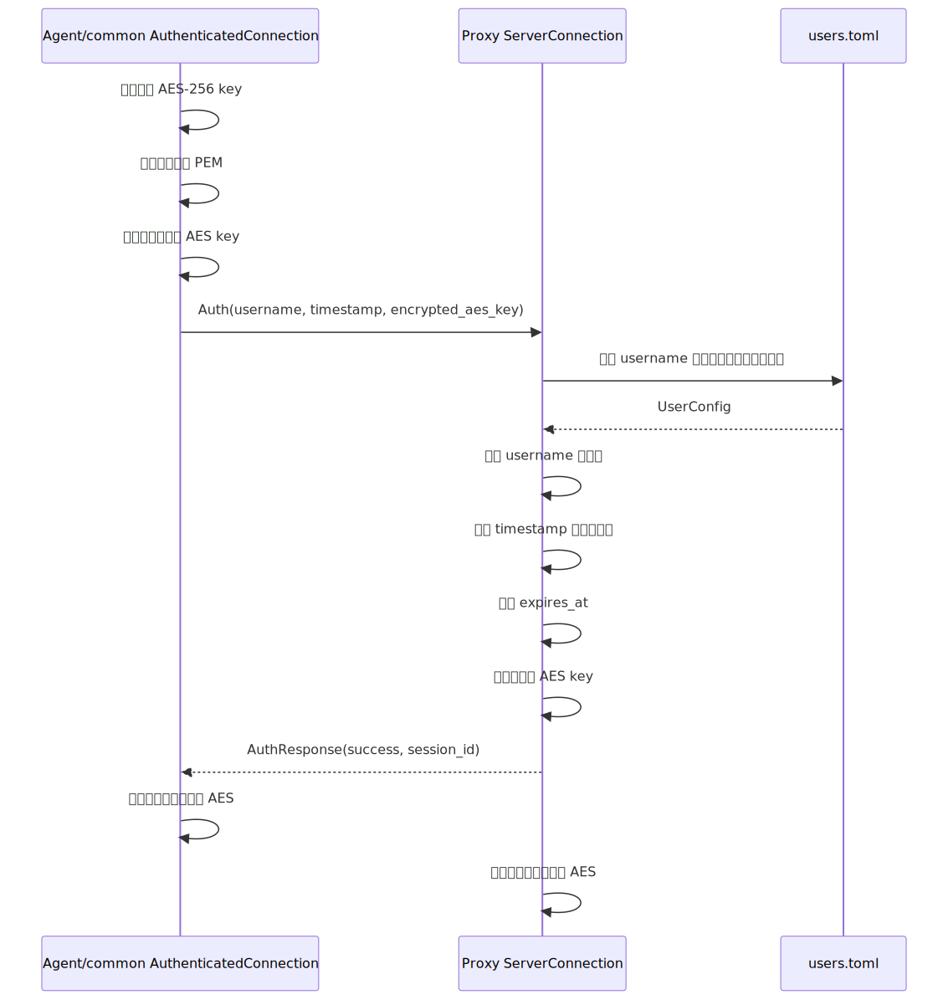

Mermaid 源码：[03-auth-encryption.mmd](diagrams/03-auth-encryption.mmd)

注意顺序：认证响应本身是未加密的。双方必须在成功响应之后才把 AES cipher 写入 `CipherState`，否则读写状态会错位。

实现细节：

- 客户端握手在 `common/src/client_connection/authenticated.rs`。
- Proxy 认证在 `proxy/src/connection/auth.rs`。
- 加解密状态在 `protocol/src/codec/cipher_state.rs`。
- AES-GCM 在 `protocol/src/crypto/aes_gcm_cipher.rs`。

安全观察：当前实现为了满足“Agent 持私钥、Proxy 持公钥”的需求，使用了私钥操作和公钥还原的 RSA 原语。这是签名式思路，不是常见的“公钥加密、私钥解密”KEM 流程。生产安全评审时，这块值得单独审计。

## 6. 连接池：legacy 与 Yamux

Agent 有两个池：

- `tcp_pool`: HTTP CONNECT、普通 HTTP、SOCKS5 TCP、TUN TCP 使用。
- `udp_pool`: SOCKS5 UDP、TUN UDP、DNS proxy、UDP relay 使用。

关键文件：

- `desktop-agent-be/src/connection_pool/pool.rs`
- `desktop-agent-be/src/connection_pool/proxy_connection.rs`
- `desktop-agent-be/src/connection_pool/pool/prewarm.rs`
- `desktop-agent-be/src/connection_pool/pool/yamux.rs`
- `common/src/client_connection/yamux.rs`


Mermaid 源码：[04-connection-pool.mmd](diagrams/04-connection-pool.mmd)

legacy 模式：

- 池里保存的是“已经 Auth，但还没 Connect 目标”的连接。
- 一条连接取出后发送一次 `ConnectRequest`，然后被本次请求消费，不再放回池。
- `pool_max_connection_age_secs` 用来避免拿到 Proxy 已经按 idle timeout 关闭的旧连接。

Yamux 模式：

- 先用普通 Auth/Connect 建立到 `Address::TcpYamux` 或 `Address::UdpYamux` 的外层连接。
- 外层连接上跑 `tokio-yamux` session。
- 每个真实目标连接打开一个子流，子流第一帧是 `ConnectRequest`。
- 成功后子流就是裸 payload 通道。

## 7. HTTP 本地代理路径

文件：`desktop-agent-be/src/http_handler.rs`


Mermaid 源码：[05-http-path.mmd](diagrams/05-http-path.mmd)

细节：

- CONNECT 不会一开始就给客户端 200。代理路径会先让 Proxy 成功连上目标，再回复 200，避免客户端拿到半开的隧道。
- 普通 HTTP 请求会把代理收到的 absolute-form URI 修正成 origin-form path/query 再发给目标。
- IPv6 Host 头有专门解析逻辑。

## 8. SOCKS5 本地代理路径

文件：

- `desktop-agent-be/src/socks5_handler.rs`
- `desktop-agent-be/src/socks5_handler/tcp.rs`
- `desktop-agent-be/src/socks5_handler/udp_associate.rs`
- `desktop-agent-be/src/socks5_handler/udp_relay.rs`


Mermaid 源码：[06-socks5-path.mmd](diagrams/06-socks5-path.mmd)

SOCKS5 本地侧不做用户认证；用户身份是 Agent 到 Proxy 的 RSA/AES 握手承担的。

## 9. Proxy 连接状态机


Mermaid 源码：[07-proxy-state-machine.mmd](diagrams/07-proxy-state-machine.mmd)

关键文件：

- `proxy/src/server.rs`: accept loop、全局连接 permit、认证超时。
- `proxy/src/connection/auth.rs`: Auth 和 pre-connect idle。
- `proxy/src/connection/connect.rs`: Connect 分流。
- `proxy/src/connection/relay.rs`: legacy TCP/UDP 中继。
- `proxy/src/connection/yamux_session.rs`: Yamux 外层 session。
- `proxy/src/connection/yamux.rs`: Yamux 子流连接目标。
- `proxy/src/connection/udp_relay.rs`: 共享 UDP relay。
- `proxy/src/connection/upstream.rs`: forward mode 连接上游 PPAASS proxy。

## 10. Legacy DataPacket 中继

legacy 模式里，Agent 和 Proxy 之间不是裸 TCP，而是协议帧：

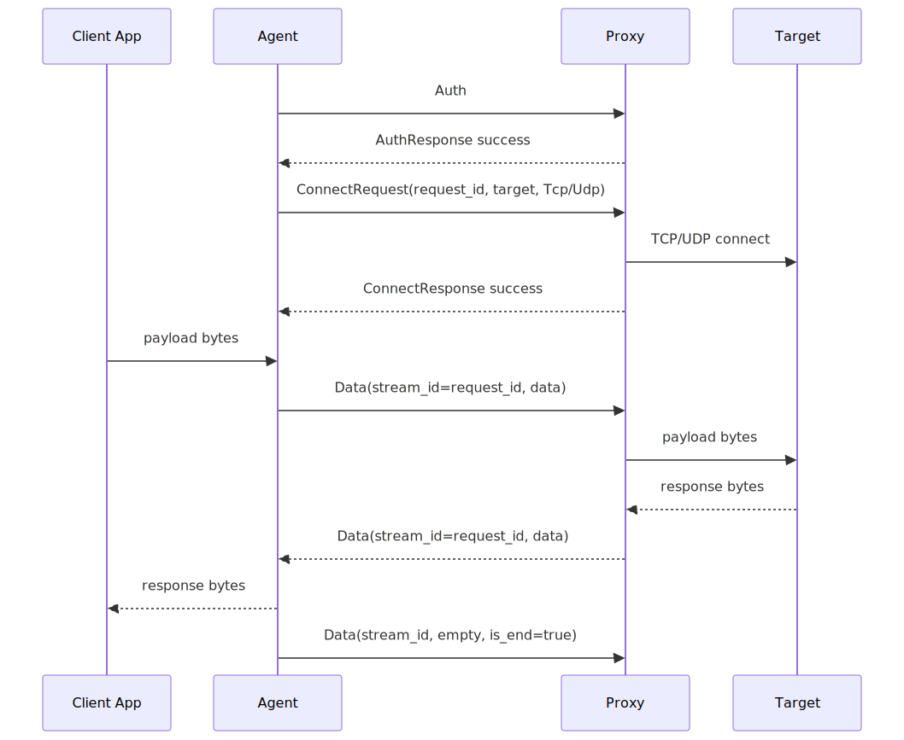

Mermaid 源码：[08-legacy-datapacket.mmd](diagrams/08-legacy-datapacket.mmd)

适配器：

- Agent 侧 `ProxyStreamIo` 把 `ProxyRequest::Data` / `ProxyResponse::Data` 适配成 `AsyncRead + AsyncWrite`。
- Proxy 侧 `AgentIo` 和 `BytesToProxyResponseSink` 做反向适配。
- 上层 HTTP/SOCKS/TUN 只看到普通字节流，所以可以使用 `copy_bidirectional_with_sizes`。

## 11. UDP relay

UDP 有两种代理语义。

### 11.1 单目标 UDP

一个 `ConnectRequest` 对应一个 UDP 目标。Proxy 端 `UdpSocket::connect(target)`，后续只收发 payload。

### 11.2 共享 UDP relay

用于高并发 UDP，尤其是 TUN 模式下很多 UDP flow。


Mermaid 源码：[09-udp-relay.mmd](diagrams/09-udp-relay.mmd)

`UdpRelayPacket` 包含：

- `flow_id`
- `address`
- `data`

Proxy 对每个 `flow_id` 维护一个 UDP socket，并用 `ConnectionLimiter` 限制：

- 单连接 flow 数。
- 全局 UDP relay flow 数。
- 全局 UDP relay buffered bytes。
- 每个内部队列大小。

## 12. TUN 模式

文件主线：

- `desktop-agent-be/src/tun_handler.rs`
- `desktop-agent-be/src/tun_handler/proxy_routing.rs`
- `desktop-agent-be/src/tun_handler/device/*`
- `desktop-agent-be/src/tun_handler/netstack.rs`
- `desktop-agent-be/src/tun_handler/tasks.rs`
- `desktop-agent-be/src/tun_handler/tcp.rs`
- `desktop-agent-be/src/tun_handler/udp.rs`
- `desktop-agent-be/src/tun_handler/dns_proxy.rs`
- `desktop-agent-be/src/tun_handler/udp_relay.rs`


Mermaid 源码：[10-tun-mode.mmd](diagrams/10-tun-mode.mmd)

TUN 模式里的关键细节：

- 必须先固定 agent 到 proxy 的控制连接出口，再安装默认路由劫持，否则控制连接会回流进 TUN。
- 桌面 TUN 使用 `netstack-smoltcp` 把 IP 包还原为 TCP/UDP。
- DNS proxy 不修改系统 DNS，而是捕获发往 53 端口的请求，通过 `Address::ProxyDns` 让 Proxy 端解析。
- DNS 响应里的域名/IP 映射会进入 `DirectDomainCache`，帮助后续 IP 连接按域名规则直连。
- 如果 DNS 缓存没命中，TCP 路径还会嗅探 TLS SNI 或 HTTP Host。
- 默认阻断未命中直连规则的 UDP/443 QUIC，让浏览器回退到 TCP/TLS。
- macOS 可使用同一个 `desktop-agent` 二进制的 helper service 模式处理 TUN/路由权限。
- Windows 启动脚本会安装最高权限计划任务来避免每次 UAC。

## 13. Proxy 出站与 forward mode

普通模式：


Mermaid 源码：[11-proxy-egress.mmd](diagrams/11-proxy-egress.mmd)

forward mode：


Mermaid 源码：[12-forward-mode.mmd](diagrams/12-forward-mode.mmd)

forward mode 里，Proxy A 作为“下游 Proxy 的服务端”和“上游 Proxy 的客户端”同时存在，连接上游时复用 `common::ClientConnection` 的 Auth/Connect 逻辑。

## 14. 配置关系

### Agent 配置

主要文件：`desktop-agent-be/src/config/agent_config.rs`

常见字段：

- `listen_addr`: 本地 HTTP/SOCKS5 监听地址。
- `proxy_addrs`: 远端 Proxy 地址列表，连接时随机选择。
- `username`: 用户名。
- `private_key_path`: 用户私钥。
- `tcp_pool_size` / `udp_pool_size`: legacy 预热连接池大小。
- `compression_mode`: `none`、`lz4`、`gzip`、`zstd`。
- `[transport] tcp_mode/udp_mode`: `auto`、`yamux`、`legacy`。
- `[yamux.tcp]` / `[yamux.udp]`: Agent 端 session 数、每 session 子流数、窗口等。
- `[tun]`: TUN 设备、DNS、QUIC、helper、状态文件。
- `[direct_access]`: `proxy_all`、`direct_all`、`rules`。

### Proxy 配置

主要文件：`proxy/src/config/proxy_config.rs`

常见字段：

- `listen_addr`: Proxy 监听地址。
- `users_path`: 用户配置文件。
- `compression_mode`: Proxy 响应编码使用的压缩模式。
- `replay_attack_tolerance`: Auth 时间戳容忍窗口，默认 300 秒。
- `[transport]`: Proxy 是否接受 Yamux 外层。
- `[yamux.tcp]` / `[yamux.udp]`: Proxy 作为 acceptor 的子流上限和窗口。
- `forward_mode`: 是否转发到上游 Proxy。
- `outbound_interface`: 出站网卡，支持空、具体网卡、`auto`。
- `dns_upstream_addr`: Proxy 端 DNS 上游。
- `auth_timeout_secs`、`pre_connect_idle_timeout_secs`、`tcp_relay_idle_timeout_secs`。
- `max_connections`、`max_connections_per_user`、`max_idle_connections_per_user`。
- UDP relay 的 flow 和缓冲限制。

### 用户配置

主要文件：

- `proxy/src/config/user_config.rs`
- `proxy/src/user_manager.rs`
- `config/local/users.toml`

字段：

- `username`: 必须与 `[users.<key>]` 的 key 一致。
- `public_key_pem`: Proxy 持有用户公钥。
- `bandwidth_limit_mbps`: 粗粒度秒级总带宽限制。
- `expires_at`: 可选 RFC3339 或 Unix 秒级时间戳。

## 15. 桌面 UI

技术栈：

- Vue 3 + TypeScript + PrimeVue。
- Tauri 2 Rust 后端。
- UI 后端直接依赖 `desktop-agent-be` crate。

主线文件：

- `desktop-agent-ui/src/App.vue`
- `desktop-agent-ui/src/composables/useDesktopAgent.ts`
- `desktop-agent-ui/src-tauri/src/app.rs`
- `desktop-agent-ui/src-tauri/src/agent.rs`
- `desktop-agent-ui/src-tauri/src/config.rs`


Mermaid 源码：[13-desktop-ui.mmd](diagrams/13-desktop-ui.mmd)

重要设计：

- UI 不是简单启动外部 `desktop-agent.exe`。非 Windows 主要走内嵌 Agent 线程。
- 启动前如果配置有脏改动，会先保存配置。
- Agent 运行中锁定配置，避免运行时改 TOML 和内存状态不一致。
- Windows 有 service / 计划任务路径。
- macOS 有 TUN helper 检查和安装路径。
- 前端有 fallback 数据，所以非 Tauri 浏览器里也能看到 UI 骨架。

## 16. Android Agent

Android 分两层：


Mermaid 源码：[14-android-agent.mmd](diagrams/14-android-agent.mmd)

关键文件：

- `android-agent/app/src/main/java/com/ppaass/ai/agent/PpaassVpnService.java`
- `android-agent/app/src/main/java/com/ppaass/ai/agent/NativeAgent.java`
- `android-agent/native/src/jni_api.rs`
- `android-agent/native/src/netstack.rs`
- `android-agent/native/src/connection_pool.rs`
- `android-agent/native/src/config.rs`

Android 和桌面 TUN 的相同点：

- 都用 `netstack-smoltcp`。
- 都复用 `common` 和 `protocol`。
- 都支持 TCP/UDP pool、Yamux、direct_access、proxy DNS、QUIC 阻断。

不同点：

- Android 的 TUN fd 由系统 `VpnService` 创建。
- 控制连接通过 `VpnService.protect(fd)` 排除出 VPN 路径。
- 配置从 Java UI 的 JSON 传给 Rust，不是读 TOML。
- Android 支持应用 allow-list。

## 17. 测试体系

测试工具在 `tests/` crate。


Mermaid 源码：[15-testing-topology.mmd](diagrams/15-testing-topology.mmd)

主要文件：

- `tests/src/mock_target.rs`: HTTP、TCP echo、UDP echo 目标。
- `tests/src/mock_client.rs`: HTTP client、SOCKS5 TCP/UDP client。
- `tests/src/integration_tests.rs`: 功能链路测试。
- `tests/src/performance_tests.rs`: 并发压测、延迟直方图、吞吐、系统指标。
- `tests/src/report.rs`: HTML/JSON/Markdown 报告。
- `run-tests.sh`: 启动测试工具的脚本。

典型运行顺序：

```bash
cargo build --release --workspace

# 终端 1
./run-tests.sh mock-target

# 终端 2
cargo run --release -p proxy -- --config config/local/proxy.toml

# 终端 3
cargo run --release -p desktop-agent-be --bin desktop-agent -- --config config/local/agent.toml

# 终端 4
./run-tests.sh integration
./run-tests.sh performance 100 60
```

注意：文档和 CI 中有的示例使用 `127.0.0.1:7070`，当前 `config/local/agent.toml` 里是 `127.0.0.1:10080`。跑测试时要让 `AGENT_ADDR` 和实际配置一致。

## 18. CI 与部署

`.github/workflows/` 里主要有：

- `unit-test.yml`: Debian container，Rust 1.93，build workspace，跑 unit tests。
- `integration-test.yml`: 启动 mock target、proxy、agent，然后跑 integration tests。
- `rust-clippy.yml`: Clippy SARIF 分析。
- `deploy-proxy.yml`: 手动选择 production/dev/qa，构建 Linux proxy，打包 `proxy`、`proxy.toml`、`users.toml`、`start-proxy.sh`，上传远端并重启。
- `checkmarx-one.yml` / `codescan.yml`: 安全/代码扫描。

部署脚本：

- `start-proxy.sh`: Linux Proxy supervisor，支持 start/stop/status/restart，可 systemd 外独立守护。
- `start-agent.bat`: Windows Agent；TUN 开启时安装/使用最高权限计划任务。
- `start-agent.sh` / `start-agent.command`: macOS/Linux Agent；macOS TUN helper 自动安装。

## 19. 建议阅读顺序

如果你要真正吃透项目，建议按这个顺序读：

1. `README.md`、`docs/REQUIREMENTS.md`：先知道业务目标。
2. `Cargo.toml`：看 workspace 和核心依赖。
3. `protocol/src/message/*.rs`：先看协议消息长什么样。
4. `protocol/src/codec/message_codec.rs`：理解帧、压缩和 AES 的位置。
5. `common/src/client_connection/authenticated.rs`：理解 Auth + Connect 客户端流程。
6. `proxy/src/server.rs`、`proxy/src/connection/auth.rs`、`proxy/src/connection/connect.rs`：看 Proxy 状态机。
7. `desktop-agent-be/src/server.rs`：看本地入口如何分 HTTP/SOCKS/TUN。
8. `desktop-agent-be/src/http_handler.rs` 和 `socks5_handler.rs`：看本地代理细节。
9. `desktop-agent-be/src/connection_pool/*`：看 legacy 和 Yamux 的性能设计。
10. `proxy/src/connection/relay.rs`、`yamux_session.rs`、`yamux.rs`、`udp_relay.rs`：看数据搬运。
11. `desktop-agent-be/src/tun_handler/*`：最后再读 TUN，因为它依赖前面所有概念。
12. `desktop-agent-ui/src-tauri/src/app.rs` 和 `agent.rs`：看 UI 如何嵌入 Agent。
13. `android-agent/native/src/netstack.rs` 和 `connection_pool.rs`：看 Android 如何复用核心。
14. `tests/src/integration_tests.rs`：用测试把理解闭环。

## 20. 常见容易误解的点

- Agent 本地 SOCKS5 默认无认证，不代表系统无用户认证；真正的用户认证发生在 Agent 到 Proxy。
- legacy 连接池不是“复用同一条目标连接”，而是预热已认证连接，一次请求消费一条。
- Yamux 外层连接本身仍然先经过普通 PPAASS Auth/Connect。
- `Address::TcpYamux`、`Address::UdpYamux`、`Address::UdpRelay`、`Address::ProxyDns` 都是协议虚拟地址，不是真实互联网目标。
- TUN 模式要先固定 proxy 控制连接的物理出口，再安装 TUN 路由。
- `direct_access` 在 TUN 模式下不仅看 IP/CIDR，还可能通过 DNS 缓存、TLS SNI、HTTP Host 还原域名规则。
- Proxy 的 `transport.auto/yamux` 都接受 Yamux；`legacy` 才拒绝 Yamux 外层连接。
- Agent 的 `transport.auto` 会尝试 Yamux，部分故障可回退 legacy；`yamux` 则更严格。
- Proxy 的 `compression_mode` 和 Agent 的 `compression_mode` 是各自发送方向的编码选择；实际解码靠消息里的 compression flag。
- 带宽限制是秒级粗粒度总量检查，不是精细 token bucket。

## 21. 一张压缩版端到端图

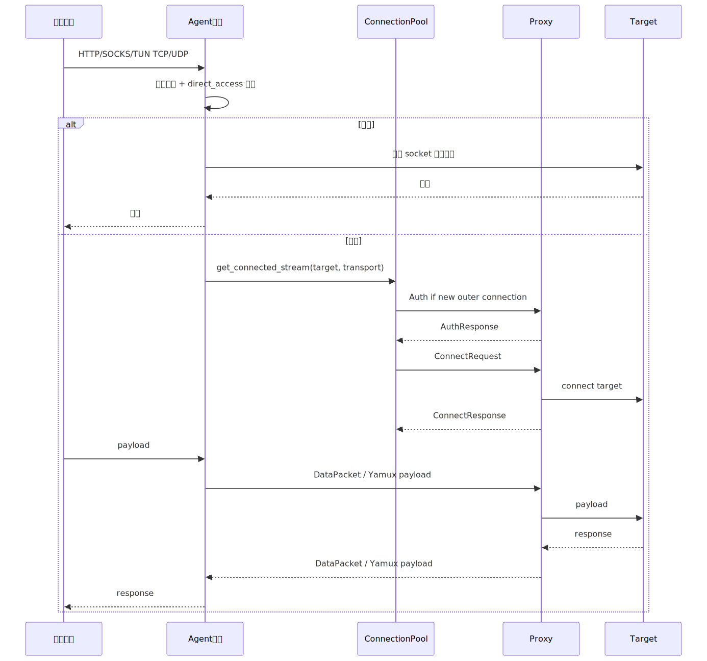

Mermaid 源码：[16-end-to-end.mmd](diagrams/16-end-to-end.mmd)

这就是整个项目的主线：入口很多，最终都收敛到“目标解析 -> 是否直连 -> Auth/Connect -> relay”。
