# PPAASS 项目学习导览

这份文档按“先看整体，再看主链路，再看复杂分支”的顺序梳理整个项目。读完以后，你应该能回答三个问题：

1. 用户的流量从哪里进入，经过哪些模块，最后如何到达目标服务器。
2. Agent 和 Proxy 之间的认证、加密、连接复用、数据封包分别由谁负责。
3. 桌面 UI、Android VPN、测试和部署脚本分别接在核心代理系统的哪个位置。

本文将流程图以 Mermaid 源码直接内联在相应章节，和文字说明一起维护。图中的 TCP 指
普通目标 TCP，UDP 指经代理的 UDP；两者的外层传输选择不同，不能混为一谈。

## 1. 项目一句话

PPAASS 是一个 Rust 实现的加密代理系统。客户端侧运行 Agent，服务端侧运行 Proxy。Agent 接收本机 HTTP/SOCKS5/TUN/VPN 流量；TCP 目标始终通过原有的独立 framed TCP 连接到 Proxy。`transport_mode = "udp"` 时，只有代理 UDP 使用原生加密 UDP 会话；`transport_mode = "tcp"` 时，代理 UDP 改由 raw TCP/Yamux 承载；`transport_mode = "auto"` 时，每个 UDP session slot 先尝试原生 UDP，认证或控制超时后仅该 slot 在当前进程内回退 TCP/Yamux。TCP 和 TCP/Yamux 路径继续使用 PPAASS Auth/Connect/Data 流协议，原生 UDP 路径使用独立的认证数据报协议。Proxy 做用户认证、出站连接和数据回传。

核心 workspace：

```text
ppaass-ai/
├── desktop-agent-be/    # 桌面 Agent 后端：HTTP/SOCKS5/TUN、TCP direct framed、原生 UDP/TCP-Yamux
├── proxy-entry/         # Proxy Entry：TCP direct framed/Yamux 与 raw UDP session、认证、目标 relay、上游转发
├── proxy-registry/      # Registry：账户、设备、密钥审批、Entry 目录、授权控制面与管理前端
├── proxy-control-protocol/ # Registry ↔ Entry 控制面 DTO 和协议契约
├── protocol/            # Agent <-> Proxy 流协议与原生 UDP 数据报协议、编解码、加密、压缩
├── common/              # Agent/Proxy 复用的客户端握手、传输选择、Yamux、工具
├── desktop-agent-ui/    # Tauri 2 + Vue 3 桌面 UI，内嵌 desktop-agent-be 运行
├── android-agent/       # Android VpnService + Rust JNI native Agent
├── tests/               # mock target、mock client、集成测试、性能测试和报告
├── config/              # local/remote 示例配置
├── keys/                # 本地忽略的密钥材料；生产身份不进入仓库
└── .github/workflows/   # unit/integration/clippy/deploy workflow
```

## 2. 总体架构图

这张图是全项目的骨架。无论流量来自桌面本地代理、桌面 TUN，还是 Android VPN，最终
都尽量复用同一套 `common`、`protocol` 和 Proxy 逻辑。


```mermaid
flowchart LR
    Browser["浏览器/应用"] -->|"HTTP / SOCKS5"| AgentListen["Desktop Agent 本地监听"]
    OS["系统流量"] -->|"TUN packets"| TunDevice["Desktop TUN 设备"]
    AndroidApps["Android 应用流量"] -->|"VpnService fd"| AndroidNative["Android Rust Native"]

    AgentListen --> AgentRouter["协议识别与目标解析"]
    TunDevice --> Netstack["netstack-smoltcp: IP 包还原 TCP/UDP"]
    Netstack --> TunRouter["TUN TCP/UDP/DNS/直连规则"]
    AndroidNative --> AndroidNetstack["Android netstack"]

    AgentRouter --> DirectCheck{"direct_access 命中?"}
    TunRouter --> DirectCheck
    AndroidNetstack --> AndroidDirect{"direct_access 命中?"}

    DirectCheck -->|"是"| LocalTarget["本地直连 TCP/UDP socket<br/>UDP 不经过 PPAASS 封装"]
    AndroidDirect -->|"是"| AndroidDirectSocket["受 protect 的直连 TCP/UDP socket<br/>UDP 不经过 PPAASS 封装"]

    DirectCheck -->|"否"| AgentTransport["Agent 目标传输管理"]
    AndroidDirect -->|"否"| AndroidTransport["Android 目标传输管理"]

    AgentTransport -->|"TCP: direct framed PPAASS"| ProxyTcp["Proxy 入站 TCP"]
    AgentTransport -->|"UDP + tcp 模式: raw Yamux"| ProxyTcp
    AgentTransport -->|"UDP + udp 模式: raw UDP datagram"| ProxyUdp["Proxy 入站 raw UDP"]
    AndroidTransport -->|"TCP: direct framed PPAASS"| ProxyTcp
    AndroidTransport -->|"UDP + tcp 模式: raw Yamux"| ProxyTcp
    AndroidTransport -->|"UDP + udp 模式: raw UDP datagram"| ProxyUdp

    ProxyTcp --> Peek{"首包像 Yamux?"}
    Peek -->|"否"| DirectFramed["direct framed PPAASS 连接"]
    Peek -->|"是"| YamuxAccept["raw Yamux session"]
    YamuxAccept --> Substream["accept 子流"]
    DirectFramed --> StreamAuth["流式 Auth/Connect/Data"]
    Substream --> StreamAuth

    ProxyUdp --> UdpSession["按 session ID 分发"]
    UdpSession --> UdpHandshake["RSA 身份认证/会话建立<br/>HKDF 双向密钥"]
    UdpSession --> UdpVerify["逐包 AES-256-GCM + AAD<br/>序号/防重放/有界重组"]
    UdpHandshake --> UdpSession
    UdpVerify --> UdpMessages["Connect/Data/Close by flow_id"]

    StreamAuth --> ConnectDispatch["Connect 分流"]
    UdpMessages --> UdpDispatch["UDP flow 分流"]
    ConnectDispatch -->|"普通 TCP/UDP"| Target["目标服务器"]
    ConnectDispatch -->|"Address::UdpRelay"| UdpRelay["共享 UDP relay"]
    UdpDispatch --> Target
    UdpDispatch --> UdpRelay
```

## 3. 最重要的三个概念

### 3.1 Agent

Agent 是客户端入口。

桌面 Agent 的入口在：

- `desktop-agent-be/src/main.rs`
- `desktop-agent-be/src/lib.rs`
- `desktop-agent-be/src/server.rs`

它做的事情：

- 读取 `agent.toml`。
- 启动 Tokio runtime。
- 监听 `listen_addr`，用首字节识别 HTTP 还是 SOCKS5。
- 如果 `[tun] enabled = true`，额外启动 TUN 模式。
- 代理 TCP 始终通过 `YamuxSessionManager::connect_to_target(...)` 返回 direct framed PPAASS TCP 流。代理 UDP 在 `udp` 模式交给有状态原生 UDP 会话，以数据报收发 `Connect/Data/Close` 消息；在 `tcp` 模式使用 Yamux 子流；`auto` 模式先采用原生 UDP，并只让超时 slot 回退 Yamux。原生 UDP 不能被当成可靠、有序的 `AsyncRead/AsyncWrite` 字节流。

### 3.2 Proxy

Proxy 是服务端出口。

入口在：

- `proxy-entry/src/main.rs`
- `proxy-entry/src/server.rs`
- `proxy-entry/src/connection/mod.rs`

它做的事情：

- 读取 `proxy-entry.toml`，通过 Registry 控制 API 同步公开授权，并按用户名查询 Entry
  自己的 SQLite last-known-good 副本；它从不打开 Registry 的权威用户库。
- 在同一个数值端口同时监听 Agent 的入站 TCP 和 raw UDP。TCP 入站先 peek 首包判断是 direct framed PPAASS 还是 raw Yamux；UDP 入站按原生协议建立、查找和维护认证 session。
- 对每条 direct framed 连接或 Yamux 子流执行流式 PPAASS Auth，再等待 `ConnectRequest`；原生 UDP 则先做 RSA 身份认证/会话建立，再处理被逐包认证的 `Connect/Data/Close` 数据报。
- 根据目标类型进入 TCP relay、单目标 UDP、共享 UDP relay、Proxy DNS 或上游转发。
- TCP relay 始终使用独立 direct framed TCP 连接；UDP relay 根据 Agent 模式使用原生加密 UDP session 池或 raw TCP/Yamux session 池。

### 3.3 Protocol

`protocol` crate 是 Agent 和 Proxy 的共同语言。

关键文件：

- `protocol/src/message/*.rs`
- `protocol/src/codec/message_codec.rs`
- `protocol/src/codec/agent_codec.rs`
- `protocol/src/codec/proxy_codec.rs`
- `protocol/src/crypto/*.rs`

它定义了：

- `ProxyRequest`: `Auth`、`Connect`、`Data`
- `ProxyResponse`: `Auth`、`Connect`、`Data`、`Error`
- `Address`: `Domain`、`Ipv4`、`Ipv6`、`ProxyDns`、`UdpRelay`
- `DataPacket`: `stream_id + data + is_end`
- `MessageCodec`: 长度前缀、bitcode 序列化、压缩、AES-GCM 加解密
- `udp_transport`: 原生 UDP 的 RSA 会话建立、方向隔离密钥、固定头、逐包 AES-256-GCM、重放窗口和有界分片/重组

### 3.4 Registry 控制面

`proxy-registry` 是身份、授权和 Entry 目录的权威控制面；它不承载代理数据。生产环境由
Caddy 在 HTTPS `:443` 后代理两组 Registry 实例：普通 Web/API 路由到公开 API，`/control/*`
路由到 Entry 控制 API。Entry 只保存可用于数据面认证的公开授权快照；Registry 的账户、
设备、私钥托管和审计数据始终留在 Registry SQLite 数据库中。

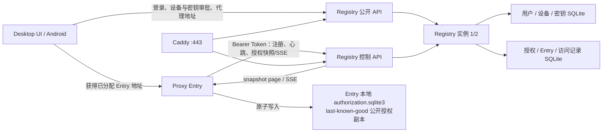
```mermaid
flowchart LR
    UI["Desktop UI / Android"] -->|"登录、设备与密钥审批、代理地址"| Public["Registry 公开 API"]
    Entry["Proxy Entry"] -->|"Bearer Token：注册、心跳、授权快照/SSE"| Control["Registry 控制 API"]
    Caddy["Caddy :443"] --> Public
    Caddy --> Control
    Public --> Registry["Registry 实例 1/2"]
    Control --> Registry
    Registry --> Users["用户 / 设备 / 密钥 SQLite"]
    Registry --> Access["授权 / Entry / 访问记录 SQLite"]
    Control -->|"snapshot page / SSE"| Entry
    Entry -->|"原子写入"| Snapshot["Entry 本地 authorization.sqlite3\nlast-known-good 公开授权副本"]
    UI -->|"获得已分配 Entry 地址"| Entry
```

## 4. Agent 启动流程

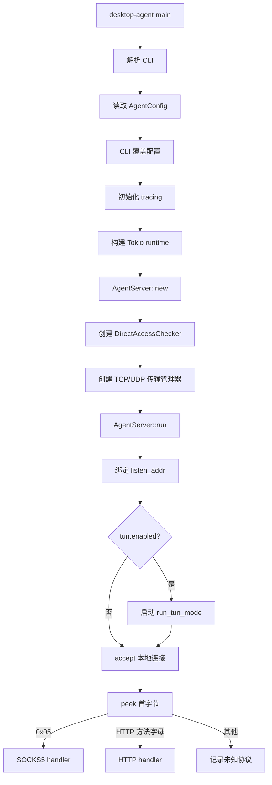
```mermaid
flowchart TD
    A["desktop-agent main"] --> B["解析 CLI"]
    B --> C["读取 AgentConfig"]
    C --> D["CLI 覆盖配置"]
    D --> E["初始化 tracing"]
    E --> F["构建 Tokio runtime"]
    F --> G["AgentServer::new"]
    G --> H["创建 DirectAccessChecker"]
    H --> I["创建 TCP/UDP 传输管理器"]
    I --> J["AgentServer::run"]
    J --> K["绑定 listen_addr"]
    K --> L{"tun.enabled?"}
    L -->|"否"| O["accept 本地连接"]
    L -->|"是"| N["启动 run_tun_mode"]
    N --> O
    O --> P["peek 首字节"]
    P -->|"0x05"| Q["SOCKS5 handler"]
    P -->|"HTTP 方法字母"| R["HTTP handler"]
    P -->|"其他"| S["记录未知协议"]
```

这里有个设计点：TUN 模式启用时，本地 HTTP/SOCKS5 监听仍然保留，所以用户可以同时用系统级 TUN 和手动浏览器代理。

## 5. 认证与加密流程

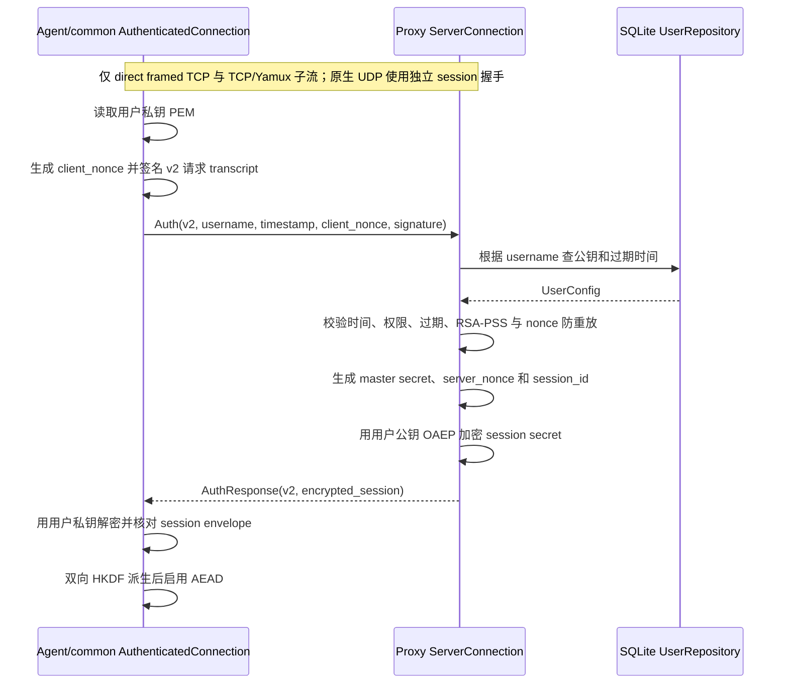
```mermaid
sequenceDiagram
    participant A as Agent/common AuthenticatedConnection
    participant P as Proxy ServerConnection
    participant U as SQLite UserRepository

    Note over A,P: 仅 direct framed TCP 与 TCP/Yamux 子流；原生 UDP 使用独立 session 握手
    A->>A: 读取用户私钥 PEM
    A->>A: 生成 client_nonce 并签名 v2 请求 transcript
    A->>P: Auth(v2, username, timestamp, client_nonce, signature)
    P->>U: 根据 username 查公钥和过期时间
    U-->>P: UserConfig
    P->>P: 校验时间、权限、过期、RSA-PSS 与 nonce 防重放
    P->>P: 生成 master secret、server_nonce 和 session_id
    P->>P: 用用户公钥 OAEP 加密 session secret
    P-->>A: AuthResponse(v2, encrypted_session)
    A->>A: 用用户私钥解密并核对 session envelope
    A->>A: 双向 HKDF 派生后启用 AEAD
```

这张图描述 direct framed TCP 与 TCP/Yamux 子流的流式握手。注意顺序：认证响应本身是未加密的。双方必须在成功响应之后才把 AES cipher 写入 `CipherState`，否则读写状态会错位。

实现细节：

- 客户端握手在 `common/src/client_connection/authenticated.rs`。
- Proxy 认证在 `proxy-entry/src/connection/auth.rs`。
- 加解密状态在 `protocol/src/codec/cipher_state.rs`。
- AES-GCM 在 `protocol/src/crypto/aes_gcm_cipher.rs`。

原生 UDP 不复用上述有序字节流状态机，其线协议在 `protocol/src/udp_transport/`：

- Agent 使用用户 RSA 私钥为 session ID、时间戳和 client nonce 的认证上下文提供身份证明；Proxy 校验用户公钥与时间窗口。
- Proxy 为成功认证的 session 产生 master key 和 server nonce，并只把 RSA 保护后的 session secret 返回给 Agent。
- 双方通过 HKDF 派生 Agent→Proxy 与 Proxy→Agent 两组 AES-256-GCM key/nonce prefix，避免双向密钥与 nonce 空间复用。
- 每个加密数据报都有独立递增的 `seq`；完整固定头（magic、version、kind、session ID、sequence、message/fragment 信息和总长度）作为 AAD。
- 接收端用滑动 replay window 在允许有限乱序的同时丢弃重复包和过旧包。原生 UDP 外层不补可靠排序或重传。
- 大消息按安全 MTU 做有界分片/重组，每个分片拥有自己的 sequence 和 AEAD tag，重组资源有大小与时限边界。

安全观察：流式 PPAASS Auth 为了满足“Agent 持私钥、Proxy 持公钥”的需求，使用了私钥操作和公钥还原的 RSA 原语。这是签名式思路，不是常见的“公钥加密、私钥解密”KEM 流程。原生 UDP 则把身份签名与 Proxy→Agent 的 RSA session-secret 保护拆开；两条路径在生产安全评审时都应单独审计。

## 6. 目标传输管理：TCP 固定 direct framed，UDP 可选原生 UDP/TCP-Yamux

Agent 保留 `tcp_sessions` 和 `udp_sessions` 等管理器概念，但两条路径的抽象不再强行统一成“目标流”：

- `tcp_sessions`: HTTP CONNECT、普通 HTTP、SOCKS5 TCP、TUN TCP 使用；无论 `transport_mode` 取何值，每个 TCP 目标都建立一条 direct framed PPAASS TCP 连接到 Proxy。
- 代理 UDP: SOCKS5 UDP、TUN UDP、DNS proxy、共享 UDP relay 使用；`transport_mode = "udp"` 时经有状态原生 UDP session 发送独立数据报，`transport_mode = "tcp"` 时从 raw TCP/Yamux 外层连接打开子流，`transport_mode = "auto"` 时每个 slot 先走前者、超时后仅该 slot 改走后者。
- 直连 UDP: `direct_access` 命中时从 Agent 本地绑定/保护的 UDP socket 直接到目标，不进入上述任一代理封装。

关键文件：

- `desktop-agent-be/src/yamux_session/manager.rs`
- `desktop-agent-be/src/yamux_session/proxy_connection.rs`
- `desktop-agent-be/src/yamux_session/manager/yamux.rs`
- `common/src/transport.rs`
- `common/src/client_connection/udp.rs`
- `common/src/client_connection/yamux.rs`
- `protocol/src/udp_transport/*.rs`

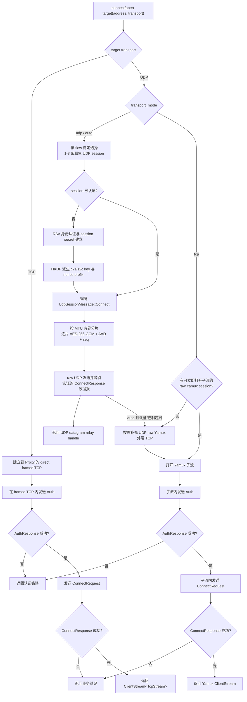
```mermaid
flowchart TD
    A["connect/open target(address, transport)"] --> B{"target transport"}
    B -->|"TCP"| C["建立到 Proxy 的 direct framed TCP"]
    C --> D["在 framed TCP 内发送 Auth"]
    D --> E{"AuthResponse 成功?"}
    E -->|"否"| Z["返回认证错误"]
    E -->|"是"| F["发送 ConnectRequest"]
    F --> G{"ConnectResponse 成功?"}
    G -->|"否"| Y["返回业务错误"]
    G -->|"是"| H["返回 ClientStream&lt;TcpStream&gt;"]

    B -->|"UDP"| I{"transport_mode"}
    I -->|"udp / auto"| J["按 flow 稳定选择<br/>1-8 条原生 UDP session"]
    J --> K{"session 已认证?"}
    K -->|"否"| L["RSA 身份认证与 session secret 建立"]
    L --> M["HKDF 派生 c2s/s2c key 与 nonce prefix"]
    K -->|"是"| N["编码 UdpSessionMessage::Connect"]
    M --> N
    N --> O["按 MTU 有界分片<br/>逐片 AES-256-GCM + AAD + seq"]
    O --> P["raw UDP 发送并等待<br/>认证的 ConnectResponse 数据报"]
    P --> Q["返回 UDP datagram relay handle"]
    P -->|"auto 且认证/控制超时"| S

    I -->|"tcp"| R{"有可立即打开子流的<br/>raw Yamux session?"}
    R -->|"否"| S["按需补充 UDP raw Yamux 外层 TCP"]
    R -->|"是"| T["打开 Yamux 子流"]
    S --> T
    T --> U["子流内发送 Auth"]
    U --> V{"AuthResponse 成功?"}
    V -->|"否"| Z
    V -->|"是"| W["子流内发送 ConnectRequest"]
    W --> X{"ConnectResponse 成功?"}
    X -->|"否"| Y
    X -->|"是"| AA["返回 Yamux ClientStream"]
```

当前传输关系：

- TCP 目标：Agent 直接连 Proxy，连接内执行 PPAASS Auth，然后发送 `ConnectRequest`，后续数据通过加密 `DataPacket` 传输；这条路径完全不读取 UDP session 数。
- 原生 UDP 模式：Agent 维护 1–8 条有状态 UDP session/socket。UDP flow 稳定映射到一个 session，先用 RSA 完成 session 身份认证和密钥建立，再发送逐包 AES-256-GCM 保护的 `Connect/Data/Close` 消息。数据报允许丢包和有限乱序，不提供外层重传或可靠有序语义。
- TCP 模式 UDP relay：Agent 到 Proxy 的外层连接是 raw TCP + `tokio-yamux`；每个 UDP relay 目标或共享 relay 通道先打开 Yamux 子流，再在子流内执行 PPAASS Auth/Connect/Data。
- Agent 启动时不预热 UDP Yamux session；`sessions` 只在 TCP 模式生效，表示最大外层连接数，请求路径在现有 session 没有可立即打开子流的容量时按需补 1 条。`udp_session_pool_size` 只属于原生 UDP 模式。
- Proxy 的 TCP accept 会判断首包是否像 Yamux header；direct framed 连接直接进入流协议状态机，Yamux 连接先 accept 子流。raw UDP listener 则按 session ID 分发数据报，完成认证、AEAD 校验、防重放、重组和 UDP flow relay。

## 7. HTTP 本地代理路径

文件：`desktop-agent-be/src/http_handler.rs`

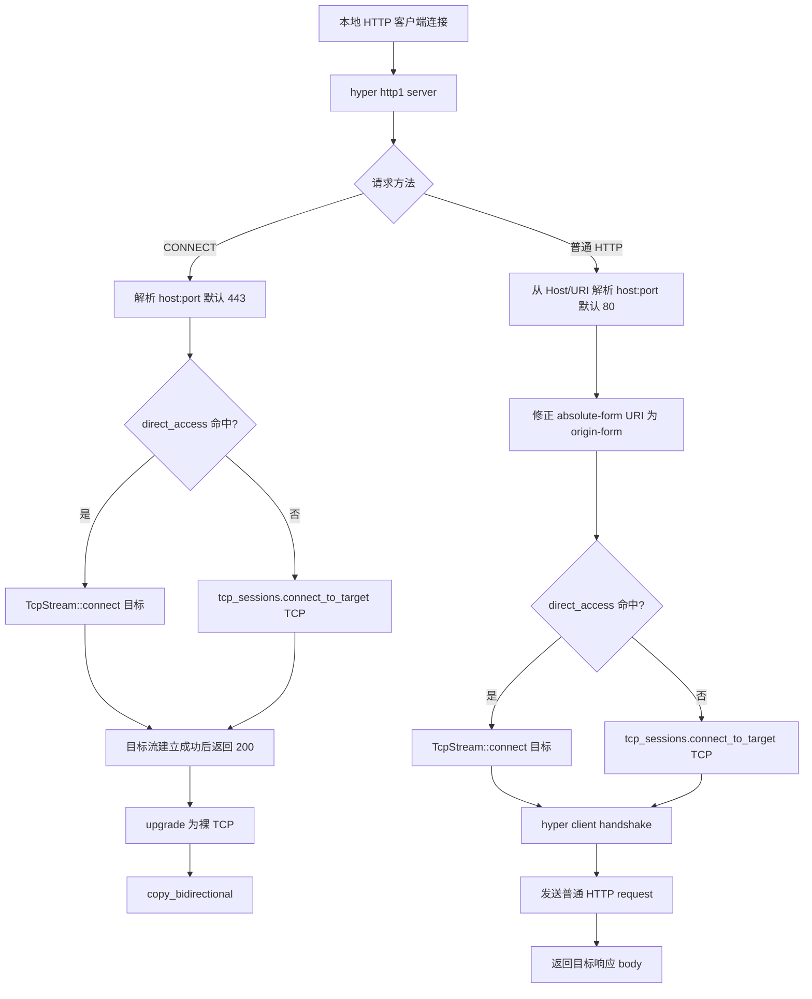
```mermaid
flowchart TD
    A["本地 HTTP 客户端连接"] --> B["hyper http1 server"]
    B --> C{"请求方法"}
    C -->|"CONNECT"| D["解析 host:port 默认 443"]
    C -->|"普通 HTTP"| E["从 Host/URI 解析 host:port 默认 80"]
    D --> F{"direct_access 命中?"}
    F -->|"是"| G["TcpStream::connect 目标"]
    F -->|"否"| H["tcp_sessions.connect_to_target TCP"]
    G --> I["目标流建立成功后返回 200"]
    H --> I
    I --> J["upgrade 为裸 TCP"]
    J --> K["copy_bidirectional"]

    E --> L["修正 absolute-form URI 为 origin-form"]
    L --> M{"direct_access 命中?"}
    M -->|"是"| N["TcpStream::connect 目标"]
    M -->|"否"| O["tcp_sessions.connect_to_target TCP"]
    N --> P["hyper client handshake"]
    O --> P
    P --> Q["发送普通 HTTP request"]
    Q --> R["返回目标响应 body"]
```

细节：

- CONNECT 不会一开始就给客户端 200。代理路径会先让 Proxy 成功连上目标，再回复 200，避免客户端拿到半开的隧道。
- 普通 HTTP 请求会把代理收到的 absolute-form URI 修正成 origin-form path/query 再发给目标。
- IPv6 Host 头有专门解析逻辑。

## 8. SOCKS5 本地代理路径

文件：

- `desktop-agent-be/src/socks5_handler.rs`
- `desktop-agent-be/src/socks5_handler/tcp.rs`
- `desktop-agent-be/src/socks5_handler/udp_associate.rs`
- `desktop-agent-be/src/socks5_handler/udp_relay.rs`

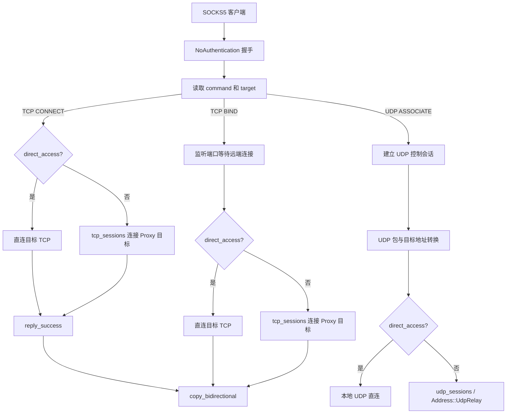
```mermaid
flowchart TD
    A["SOCKS5 客户端"] --> B["NoAuthentication 握手"]
    B --> C["读取 command 和 target"]
    C -->|"TCP CONNECT"| D{"direct_access?"}
    D -->|"是"| E["直连目标 TCP"]
    D -->|"否"| F["tcp_sessions 连接 Proxy 目标"]
    E --> G["reply_success"]
    F --> G
    G --> H["copy_bidirectional"]
    C -->|"TCP BIND"| I["监听端口等待远端连接"]
    I --> J{"direct_access?"}
    J -->|"是"| K["直连目标 TCP"]
    J -->|"否"| L["tcp_sessions 连接 Proxy 目标"]
    K --> H
    L --> H
    C -->|"UDP ASSOCIATE"| M["建立 UDP 控制会话"]
    M --> N["UDP 包与目标地址转换"]
    N --> O{"direct_access?"}
    O -->|"是"| P["本地 UDP 直连"]
    O -->|"否"| Q["udp_sessions / Address::UdpRelay"]
```

SOCKS5 本地侧不做用户认证；用户身份是 Agent 到 Proxy 的 RSA/AES 握手承担的。

## 9. Proxy 连接状态机

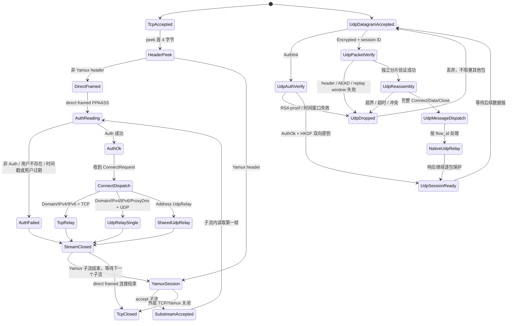
```mermaid
stateDiagram-v2
    [*] --> TcpAccepted
    TcpAccepted --> HeaderPeek: peek 首 4 字节
    HeaderPeek --> DirectFramed: 非 Yamux header
    HeaderPeek --> YamuxSession: Yamux header
    DirectFramed --> AuthReading: direct framed PPAASS
    YamuxSession --> SubstreamAccepted: accept 子流
    SubstreamAccepted --> AuthReading: 子流内读取第一帧
    AuthReading --> AuthFailed: 非 Auth / 用户不存在 / 时间戳或用户过期
    AuthFailed --> StreamClosed
    AuthReading --> AuthOk: Auth 成功
    AuthOk --> ConnectDispatch: 收到 ConnectRequest
    ConnectDispatch --> TcpRelay: Domain/IPv4/IPv6 + TCP
    ConnectDispatch --> UdpRelaySingle: Domain/IPv4/IPv6/ProxyDns + UDP
    ConnectDispatch --> SharedUdpRelay: Address UdpRelay
    TcpRelay --> StreamClosed
    UdpRelaySingle --> StreamClosed
    SharedUdpRelay --> StreamClosed
    StreamClosed --> YamuxSession: Yamux 子流结束，等待下一个子流
    StreamClosed --> TcpClosed: direct framed 连接结束
    YamuxSession --> TcpClosed: 外层 TCP/Yamux 关闭

    [*] --> UdpDatagramAccepted
    UdpDatagramAccepted --> UdpAuthVerify: AuthInit
    UdpAuthVerify --> UdpDropped: RSA proof / 时间窗口失败
    UdpAuthVerify --> UdpSessionReady: AuthOk + HKDF 双向密钥
    UdpDatagramAccepted --> UdpPacketVerify: Encrypted + session ID
    UdpPacketVerify --> UdpDropped: header / AEAD / replay window 失败
    UdpPacketVerify --> UdpReassembly: 独立分片验证成功
    UdpReassembly --> UdpDropped: 超界 / 超时 / 冲突
    UdpReassembly --> UdpMessageDispatch: 完整 Connect/Data/Close
    UdpMessageDispatch --> NativeUdpRelay: 按 flow_id 处理
    NativeUdpRelay --> UdpSessionReady: 响应继续逐包保护
    UdpSessionReady --> UdpDatagramAccepted: 等待后续数据报
    UdpDropped --> UdpDatagramAccepted: 丢弃，不阻塞其他包
```

关键文件：

- `proxy-entry/src/server.rs`: 入站 TCP/raw UDP accept、direct framed/Yamux 识别、原生 UDP session 分发与认证超时。
- `proxy-entry/src/native_udp.rs`: raw UDP listener、session 生命周期、认证消息、flow relay 与回包。
- `proxy-entry/src/connection/auth.rs`: 每条 direct framed 连接或 Yamux 子流内的流式 Auth。
- `proxy-entry/src/connection/connect.rs`: Connect 分流。
- `proxy-entry/src/connection/relay.rs`: TCP/单目标 UDP 中继。
- `proxy-entry/src/connection/udp_relay.rs`: 共享 UDP relay。
- `protocol/src/udp_transport/`: raw UDP listener 使用的认证、packet codec、防重放和重组规则。

## 10. UDP 的两种代理承载与自动回退

UDP relay 的两种底层承载共享上层 flow/目标语义，但线协议不同。`udp` 模式通过认证的原生数据报传递 `OpenData`、`ConnectResponse`、`Data`、`Close` 和保活消息；`OpenData` 把目标地址与首个 UDP payload 合并，不再单独往返 `Connect`。`tcp` 模式则为 UDP 目标或共享 relay 打开 Yamux 子流，并继续使用完整的 PPAASS Auth/Connect/Data 帧。`auto` 先采用原生 UDP；某个 session slot 的认证或控制超时时，仅该 slot 在当前 Agent 进程内回退 TCP/Yamux。TCP 目标始终使用 direct framed TCP，不进入任何 UDP transport 分支。

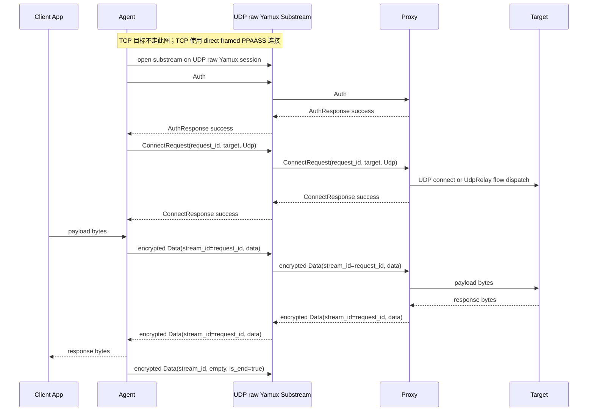
```mermaid
sequenceDiagram
    participant C as Client App
    participant A as Agent
    participant Y as UDP raw Yamux Substream
    participant P as Proxy
    participant T as Target

    Note over A,Y: TCP 目标不走此图；TCP 使用 direct framed PPAASS 连接
    A->>Y: open substream on UDP raw Yamux session
    A->>Y: Auth
    Y->>P: Auth
    P-->>Y: AuthResponse success
    Y-->>A: AuthResponse success
    A->>Y: ConnectRequest(request_id, target, Udp)
    Y->>P: ConnectRequest(request_id, target, Udp)
    P->>T: UDP connect or UdpRelay flow dispatch
    P-->>Y: ConnectResponse success
    Y-->>A: ConnectResponse success
    C->>A: payload bytes
    A->>Y: encrypted Data(stream_id=request_id, data)
    Y->>P: encrypted Data(stream_id=request_id, data)
    P->>T: payload bytes
    T-->>P: response bytes
    P-->>Y: encrypted Data(stream_id=request_id, data)
    Y-->>A: encrypted Data(stream_id=request_id, data)
    A-->>C: response bytes
    A->>Y: encrypted Data(stream_id, empty, is_end=true)
```

TCP/Yamux 模式顺序：

- Agent 在 Yamux 子流内发送 `Auth`。
- Proxy 对该业务流认证成功后返回 `AuthResponse`。
- Agent 在同一业务流内发送目标 `ConnectRequest`，例如单目标 UDP 或 `Address::UdpRelay`。
- 成功后双方继续通过加密的 `DataPacket` 传输 payload 和半关闭信号。
- 上层 SOCKS/TUN UDP 只看到普通 UDP payload；raw TCP/Yamux 提供复用和流控。

原生 UDP 模式先建立共享 session，再以 `flow_id` 关联每个目标的 Connect/Data/Close。每个数据报或分片单独加密认证，接收端只有在 AEAD、sequence/replay window 和分片重组全部通过后才把消息交给 relay。它不会把多条数据报拼成可靠字节流，也不会因丢包阻塞后续独立数据报。

## 11. UDP relay

UDP 有两种代理语义。

### 11.1 单目标 UDP

一个 `ConnectRequest` 对应一个 UDP 目标。Proxy 端 `UdpSocket::connect(target)`，后续只收发 payload。

### 11.2 共享 UDP relay

用于高并发 UDP，尤其是 TUN 模式下很多 UDP flow。

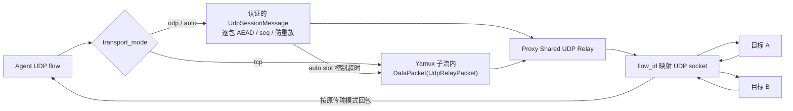
```mermaid
flowchart LR
    Agent["Agent UDP flow"] --> Mode{"transport_mode"}
    Mode -->|"udp / auto"| Native["认证的 UdpSessionMessage<br/>逐包 AEAD / seq / 防重放"]
    Mode -->|"tcp"| Yamux["Yamux 子流内<br/>DataPacket(UdpRelayPacket)"]
    Native -->|"auto slot 控制超时"| Yamux
    Native --> Proxy["Proxy Shared UDP Relay"]
    Yamux --> Proxy
    Proxy --> Table["flow_id 映射 UDP socket"]
    Table --> TargetA["目标 A"]
    Table --> TargetB["目标 B"]
    TargetA --> Table
    TargetB --> Table
    Table -->|"按原传输模式回包"| Agent
```

TCP/Yamux 模式在 `DataPacket` 内使用 `UdpRelayPacket`，原生 UDP 模式在已认证的 `UdpSessionMessage` 内表达等价的 flow/target/payload 关系。共享 relay 的核心字段包括：

- `flow_id`
- `address`
- `data`

Proxy 对每个 `flow_id` 维护一个 UDP socket。资源控制包括：

- 每个内部队列大小。
- 每条共享 relay 的内层 flow/目标 socket 上限；达到上限后已有 flow 继续工作，新 flow 在创建 socket 前被丢弃。
- 每条原生 UDP session 的外层 flow 上限；达到上限后重复 Connect 保持幂等，新 Connect 返回失败。
- 每个 UDP flow 的 idle timeout。
- 每条原生 UDP session 的分片重组默认最多保留 64 条未完整消息和 1 MiB payload，仍可容纳单条 70 KiB 协议消息。

## 12. TUN 模式

文件主线：

- `desktop-agent-be/src/tun_handler.rs`
- `desktop-agent-be/src/tun_handler/proxy_routing.rs`
- `desktop-agent-be/src/tun_handler/device/*`
- `desktop-agent-be/src/tun_handler/netstack.rs`
- `desktop-agent-be/src/tun_handler/tasks.rs`
- `desktop-agent-be/src/tun_handler/tcp.rs`
- `desktop-agent-be/src/tun_handler/udp.rs`
- `desktop-agent-be/src/tun_handler/dns_proxy.rs`
- `desktop-agent-be/src/tun_handler/udp_relay.rs`

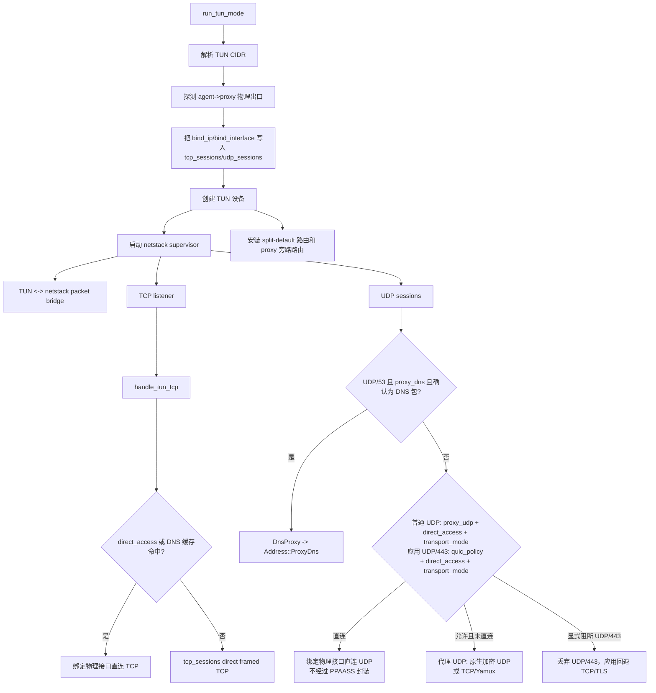
```mermaid
flowchart TD
    A["run_tun_mode"] --> B["解析 TUN CIDR"]
    B --> C["探测 agent->proxy 物理出口"]
    C --> D["把 bind_ip/bind_interface 写入 tcp_sessions/udp_sessions"]
    D --> E["创建 TUN 设备"]
    E --> F["启动 netstack supervisor"]
    F --> G["TUN <-> netstack packet bridge"]
    F --> H["TCP listener"]
    F --> I["UDP sessions"]
    E --> J["安装 split-default 路由和 proxy 旁路路由"]
    H --> K["handle_tun_tcp"]
    K --> L{"direct_access 或 DNS 缓存命中?"}
    L -->|"是"| M["绑定物理接口直连 TCP"]
    L -->|"否"| N["tcp_sessions direct framed TCP"]

    I --> O{"UDP/53 且 proxy_dns 且确认为 DNS 包?"}
    O -->|"是"| P["DnsProxy -> Address::ProxyDns"]
    O -->|"否"| Q{"普通 UDP: proxy_udp + direct_access + transport_mode<br/>应用 UDP/443: quic_policy + direct_access + transport_mode"}
    Q -->|"直连"| R["绑定物理接口直连 UDP<br/>不经过 PPAASS 封装"]
    Q -->|"允许且未直连"| S["代理 UDP: 原生加密 UDP<br/>或 TCP/Yamux"]
    Q -->|"显式阻断 UDP/443"| T["丢弃 UDP/443，应用回退 TCP/TLS"]
```

TUN 模式里的关键细节：

- 必须先固定 agent 到 proxy 的控制连接出口，再安装默认路由劫持，否则控制连接会回流进 TUN。
- 桌面 TUN 使用 `netstack-smoltcp` 把 IP 包还原为 TCP/UDP。
- DNS proxy 不修改系统 DNS，而是捕获发往 53 端口的请求，通过 `Address::ProxyDns` 让 Proxy 端解析。
- **不修改系统 DNS 是桌面 TUN 的硬约束**：Windows 与 macOS 的启动、运行、停止、清理、迁移和异常恢复流程都不得改写物理网卡、macOS 网络服务或 Agent 创建的 TUN/Wintun 网卡 DNS，也不得调用 `Set-DnsClientServerAddress`、`networksetup -setdnsservers` 或同类系统写 API。
- Windows 保留操作系统当前选择的 DNS 地址，通过指向 Wintun 的 `/32`（IPv4）或 `/128`（IPv6）捕获路由让查询进入应用内 `DnsProxy`；macOS 使用 PF `route-to` 规则，仅捕获发往原 DNS 服务器的 UDP/TCP 53 流量。两端都不替换系统配置里的 DNS 服务器地址。
- 旧版本可能在异常退出后留下 `tun-dns.json`。新版本只告警并保留该文件供人工核对，不得自动应用其中的值，以免覆盖用户在异常退出后手工调整的 DNS；新版本也不得创建新的 DNS 配置 lease。
- DNS 响应里的域名/IP 映射会进入 `DirectDomainCache`，帮助后续 IP 连接按域名规则直连。
- TUN TCP 不再读取首包嗅探 TLS SNI/HTTP Host；域名规则只依赖显式域名目标或 DNS proxy 记录的域名/IP 缓存。代理路径先连接原始 IP；若原始 IPv6 连接失败且缓存中有域名，则用域名重试，让 Proxy 可选择可达的 IPv4 地址。
- `[tun].proxy_udp` 默认开启，未命中直连规则的普通 UDP 沿用共享 UDP relay；`udp` 模式通过原生加密 UDP session 承载，`tcp` 模式通过 TCP/Yamux 承载，`auto` 则先走原生 UDP、在单 slot 超时后回退 TCP/Yamux。关闭后除代理 DNS 与独立处理的 UDP/443 应用层 QUIC 外，其余 UDP 由 Agent 绑定物理出口直接发往目标。
- UDP/443 命中直连规则时由 Agent 的绑定/保护 UDP socket 直接到目标，完全不经过 PPAASS 原生 UDP 封装；未命中时使用共享 UDP relay，并按 `transport_mode` 选择原生 UDP、TCP/Yamux，或自动回退路径。
- `proxy_dns` 与 `proxy_udp` 独立；开启代理 DNS 时，有效 DNS 请求仍交给 Proxy 端解析。
- `quic_policy` 只控制应用层 UDP/443 QUIC：默认允许命中 `direct_access` 的流量直连，未命中时按所选 UDP transport 代理；只有显式配置 `block` 才促使应用回退 TCP/TLS。
- `[tun.packet_capture]` 只配置 PCAP 输出路径；抓包由桌面 UI 在运行时控制且默认关闭，开启、关闭和清空都不重启 Agent。它把 TUN 包桥两侧的原始 IP 包，以及 HTTP/SOCKS5 本地代理连接（含 SOCKS5 UDP）在 Client/Agent socket 边界传输的数据写入同一份 DLT_RAW PCAP；显式代理字节会使用真实 Client 与 Agent 监听端点封装成合法 IP/TCP 或 IP/UDP 包。PPAASS 传输层加密前后的数据可见，但 Client 自身的 TLS/QUIC 加密不会被解除。写盘由独立线程批量完成，网络热路径只尝试写入有界队列；磁盘跟不上时丢弃抓包副本而不阻塞代理流量。
- macOS 可使用同一个 `desktop-agent` 二进制的 helper service 模式处理 TUN/路由权限。
- Windows 启动脚本会安装最高权限计划任务来避免每次 UAC。

## 13. Proxy 出站

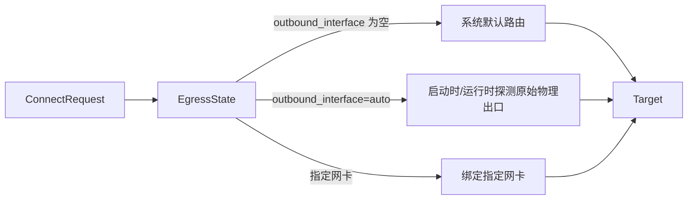
```mermaid
flowchart LR
    ConnectRequest["ConnectRequest"] --> EgressState["EgressState"]
    EgressState -->|"outbound_interface 为空"| DefaultRoute["系统默认路由"]
    EgressState -->|"outbound_interface=auto"| OriginalRoute["启动时/运行时探测原始物理出口"]
    EgressState -->|"指定网卡"| BoundInterface["绑定指定网卡"]
    DefaultRoute --> Target["Target"]
    OriginalRoute --> Target
    BoundInterface --> Target
```

Proxy Entry 收到通过认证的 Connect 请求后，直接按目标地址建立出站连接；不再支持把流量级联到另一个 Proxy Entry。

## 14. 配置关系

### Agent 配置

主要文件：`desktop-agent-be/src/config/agent_config.rs`

常见字段：

- `listen_addr`: 本地 HTTP/SOCKS5 监听地址。
- 远端 Proxy 地址在用户认证后由 Proxy Registry 作为受管运行时数据分配，连接时随机选择；
  `agent.toml` 不再接受旧的 `proxy_addrs` 字段。
- `username`: 用户名。
- `private_key_path`: 用户私钥。
- `transport_mode`: 接受 `udp`、`tcp`、`auto`；`udp` 是 TCP direct framed + 原生加密 UDP，`tcp` 是 TCP direct framed + UDP TCP/Yamux，`auto` 是 TCP direct framed + 每 slot 原生 UDP 超时回退 TCP/Yamux。旧值 `quic` 不兼容且会被拒绝，不做别名或自动迁移。
- `udp_session_pool_size`: 原生 UDP 与 `auto` relay 使用，范围 1–8；每项代表一条有状态 UDP session/socket，TCP 目标完全不读取该值。旧字段 `quic_connection_pool_size` 同样会被拒绝。
- `compression_mode`: `none`、`lz4`、`gzip`、`zstd`；仅用于 framed TCP/TCP-Yamux，原生加密 UDP 数据报不压缩。
- `[yamux.udp]`: `tcp` 模式和 `auto` 的已回退 slot 在 Agent 端 UDP relay 使用的 raw Yamux 最大 session 数、每 session 子流数、窗口等。TCP relay 始终不使用 Yamux session。
- `[tun]`: TUN 设备、普通 UDP 直连/代理切换、DNS、应用层 UDP/443 QUIC policy、helper、状态文件。
- `[direct_access]`: `proxy_all`、`direct_all`、`rules`。

### Proxy 配置

主要文件：`proxy-entry/src/config/proxy_config.rs`

常见字段：

- `listen_addr`: Proxy 监听地址。
- Proxy 在 `listen_addr` 的同一数值端口绑定 TCP 与 raw UDP；启用原生 UDP 模式时防火墙必须同时放行 UDP。
- `advertised_address`: 必填的 Agent 公网连接地址；格式为 `host:port`，注册后自动合并到 Proxy 节点目录。
- `registry_url`: 必填的 Registry HTTP 或 HTTPS 地址；Entry 不校验 HTTPS 证书链或主机名。
- `registry_control_token_path`: 必填的控制面 Token 文件。
- `authorization_database_path`: 必填的 Entry 本地公开授权副本 SQLite 路径；生产环境使用
  `/var/lib/ppaass-entry/authorization.sqlite3`。
- `entry_id`: 访问记录幂等批次使用的稳定 Entry 标识。
- Entry 在 TCP/UDP 监听成功后每 30 秒向 Registry 注册心跳；超过 90 秒未收到心跳时，管理界面显示离线。
- 每次注册成功及收到授权 SSE 变更后，Entry 以 revision 绑定的 username keyset cursor
  分页获取公钥授权，每页写入本地 staging，全部完成后原子替换 last-known-good。首份快照
  前认证默认拒绝；首份成功后 Registry 中断不会影响已有用户，中断期间的停用、撤权、
  删除和密钥轮换在恢复同步后生效。
- `compression_mode`: Proxy framed TCP/TCP-Yamux 响应编码使用的压缩模式；不影响原生 UDP。
- `replay_attack_tolerance`: Auth 时间戳容忍窗口，默认 300 秒。
- `[yamux]`: Proxy 作为 `tcp` 模式与 `auto` 回退 UDP Yamux acceptor 的子流上限、窗口和超时。TCP 入站 framed 连接进入 PPAASS 流协议处理；raw UDP 入站进入独立的 session packet codec。
- `outbound_interface`: 出站网卡，支持空、具体网卡、`auto`。
- `dns_upstream_addr`: Proxy 端 DNS 上游。
- `auth_timeout_secs`、`tcp_relay_idle_timeout_secs`、`yamux_session_idle_timeout_secs`。
- `udp_relay_channel_size`: 共享 UDP relay 每条内部队列大小。
- `udp_relay_max_flows`: 每条共享 UDP relay 的内层 flow/目标 socket 上限，默认 256。
- `udp_session_limit`: 同时存在的已认证原生 UDP session 上限，默认 4096。
- `udp_session_channel_size`: 每个原生 UDP session 的有界数据报队列，默认 256。
- `udp_session_max_flows`: 每个原生 UDP session 的外层 flow 上限，默认 256。

### 用户配置

主要文件：

- `proxy-entry/src/config/user_config.rs`
- `proxy-entry/src/user_manager.rs`
- `proxy-registry/src/store/repository.rs`

字段：

- `username`: SQLite 用户记录中的稳定认证名。
- `public_key_pem`: Proxy 持有用户公钥。
- `expires_at`: 可选 RFC3339 或 Unix 秒级时间戳。

## 15. 桌面 UI

技术栈：

- Vue 3 + TypeScript + PrimeVue。
- Tauri 2 Rust 后端。
- UI 后端直接依赖 `desktop-agent-be` crate。

主线文件：

- `desktop-agent-ui/src/App.vue`
- `desktop-agent-ui/src/composables/useDesktopAgent.ts`
- `desktop-agent-ui/src-tauri/src/app.rs`
- `desktop-agent-ui/src-tauri/src/agent.rs`
- `desktop-agent-ui/src-tauri/src/config.rs`

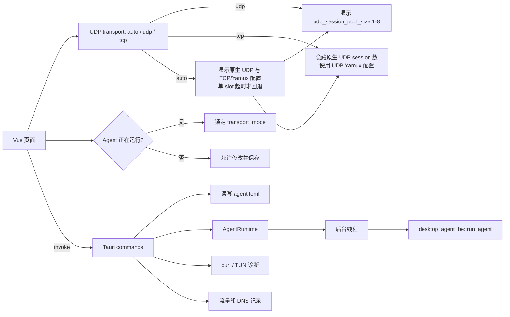
```mermaid
flowchart LR
    Vue["Vue 页面"] --> Transport["UDP transport: auto / udp / tcp"]
    Transport -->|"udp"| SessionCount["显示 udp_session_pool_size 1-8"]
    Transport -->|"tcp"| YamuxConfig["隐藏原生 UDP session 数<br/>使用 UDP Yamux 配置"]
    Transport -->|"auto"| AutoMode["显示原生 UDP 与 TCP/Yamux 配置<br/>单 slot 超时才回退"]
    AutoMode --> SessionCount
    AutoMode --> YamuxConfig
    RuntimeState{"Agent 正在运行?"} -->|"是"| Locked["锁定 transport_mode"]
    RuntimeState -->|"否"| Editable["允许修改并保存"]
    Vue --> RuntimeState
    Vue -->|"invoke"| TauriCmd["Tauri commands"]
    TauriCmd --> Config["读写 agent.toml"]
    TauriCmd --> Runtime["AgentRuntime"]
    Runtime --> Thread["后台线程"]
    Thread --> Embedded["desktop_agent_be::run_agent"]
    TauriCmd --> Diagnostics["curl / TUN 诊断"]
    TauriCmd --> Telemetry["流量和 DNS 记录"]
```

重要设计：

- UI 不是简单启动外部 `desktop-agent.exe`。非 Windows 主要走内嵌 Agent 线程。
- 启动前如果配置有脏改动，会先保存配置。
- Agent 运行中锁定配置，避免运行时改 TOML 和内存状态不一致。
- 传输模式提供“自动”“原生加密 UDP”“TCP/Yamux”：自动模式同时显示原生 UDP session 与 TCP/Yamux 配置，并仅在对应 slot 超时时回退；TCP 目标的说明始终是原有 direct framed TCP。Agent 启动后传输模式不能切换。
- Windows 有 service / 计划任务路径。
- macOS 有 TUN helper 检查和安装路径。
- 前端有 fallback 数据，所以非 Tauri 浏览器里也能看到 UI 骨架。

## 16. Android Agent

Android 分两层：

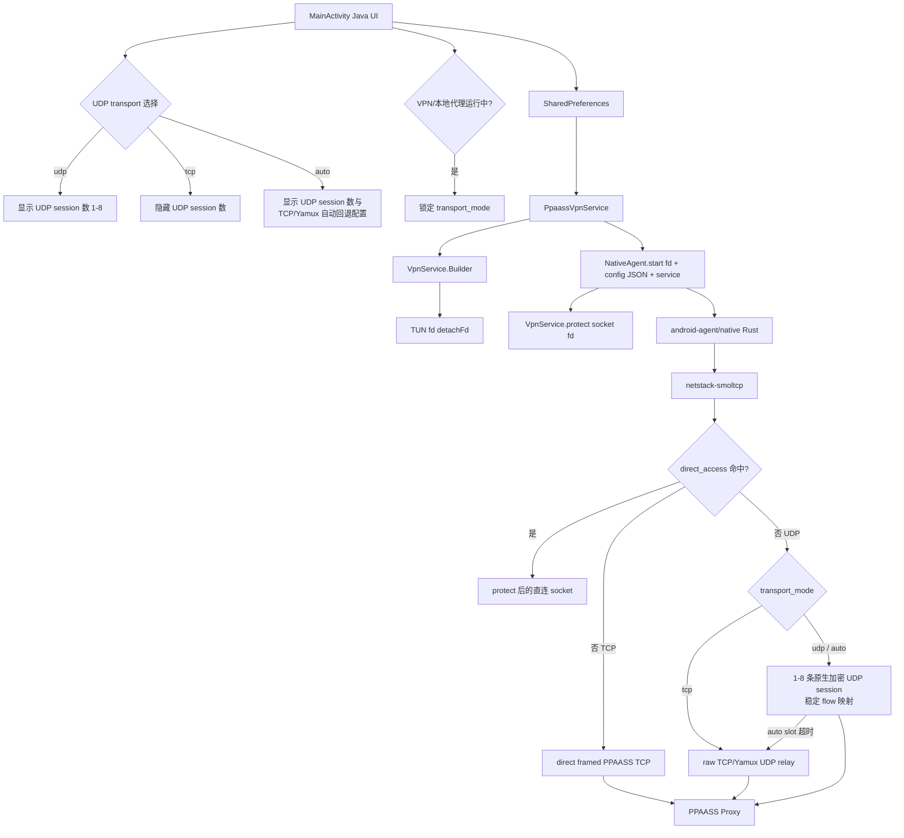
```mermaid
flowchart TD
    JavaUI["MainActivity Java UI"] --> ModeUi{"UDP transport 选择"}
    ModeUi -->|"udp"| PoolUi["显示 UDP session 数 1-8"]
    ModeUi -->|"tcp"| HidePool["隐藏 UDP session 数"]
    ModeUi -->|"auto"| AutoUi["显示 UDP session 数与<br/>TCP/Yamux 自动回退配置"]
    JavaUI --> Running{"VPN/本地代理运行中?"}
    Running -->|"是"| LockMode["锁定 transport_mode"]
    JavaUI --> Prefs["SharedPreferences"]
    Prefs --> Service["PpaassVpnService"]
    Service --> Builder["VpnService.Builder"]
    Builder --> Fd["TUN fd detachFd"]
    Service --> JNI["NativeAgent.start fd + config JSON + service"]
    JNI --> Protector["VpnService.protect socket fd"]
    JNI --> Rust["android-agent/native Rust"]
    Rust --> Netstack["netstack-smoltcp"]
    Netstack --> Direct{"direct_access 命中?"}
    Direct -->|"是"| ProtectedSocket["protect 后的直连 socket"]
    Direct -->|"否 TCP"| TcpProxy["direct framed PPAASS TCP"]
    Direct -->|"否 UDP"| UdpMode{"transport_mode"}
    UdpMode -->|"udp / auto"| UdpNative["1-8 条原生加密 UDP session<br/>稳定 flow 映射"]
    UdpMode -->|"tcp"| UdpProxy["raw TCP/Yamux UDP relay"]
    UdpNative -->|"auto slot 超时"| UdpProxy
    TcpProxy --> Proxy["PPAASS Proxy"]
    UdpProxy --> Proxy
    UdpNative --> Proxy
```

关键文件：

- `android-agent/app/src/main/java/com/ppaass/ai/agent/PpaassVpnService.java`
- `android-agent/app/src/main/java/com/ppaass/ai/agent/NativeAgent.java`
- `android-agent/native/src/jni_api.rs`
- `android-agent/native/src/netstack.rs`
- `android-agent/native/src/yamux_session.rs`
- `android-agent/native/src/config.rs`

Android 和桌面 TUN 的相同点：

- 都用 `netstack-smoltcp`。
- 都复用 `common` 和 `protocol`。
- 都支持 TCP 固定 direct framed、UDP 原生加密 UDP/TCP-Yamux/自动回退传输、direct_access、proxy DNS、应用层 QUIC 分流和可选 QUIC 阻断。桌面 TUN 还可通过 `proxy_udp` 将代理 DNS 与 UDP/443 应用层 QUIC 之外的普通 UDP 切换为 Agent 本地直连。

不同点：

- Android 的 TUN fd 由系统 `VpnService` 创建。
- 控制连接通过 `VpnService.protect(fd)` 排除出 VPN 路径。
- 配置从 Java UI 的 JSON 传给 Rust，不是读 TOML。
- Android 支持应用 allow-list。
- Android UI 在 `udp` 或 `auto` 模式时显示 1–8 的原生 UDP session 数；`auto` 还显示 TCP/Yamux 回退配置。VPN 或本地 HTTP/SOCKS5 Agent 运行期间锁定传输模式，避免界面选择与 native 运行状态分离。
- Android 运行时抓包默认关闭。开启后，VPN/TUN 原始 IP 包与显式 HTTP、SOCKS5 TCP 的 Client↔Agent 字节进入同一份 DLT_RAW PCAP；显式代理使用带 native 自描述 TCP option 标记的合成 IP/TCP 包，因而 HTTP/SOCKS5 入口类型和方向不依赖端口或后续 payload 猜测。TLS payload 仍是密文。Android 的 SOCKS5 入口不支持 UDP ASSOCIATE，所以这里不包含 SOCKS5 UDP；桌面抓包仍支持 SOCKS5 UDP。
- Android PCAP 重新开启时安全追加到兼容文件，并修复不完整尾记录；不兼容或中间损坏的文件原样保留并要求用户先备份或清空。抓包页可独立过滤 HTTP/SOCKS5 代理标签，数据包列表按可用视口填满下方区域并在内部滚动。
- Android 代理 DNS 面板可按域名、IP、客户端、状态和解析器过滤记录；选中记录后既可生成直连域名/IP 规则，也可移除覆盖这些记录的现有直连规则，并在需要时重启正在运行的 VPN 或 HTTP/SOCKS5 Agent。

## 17. 测试体系

测试工具在 `tests/` crate。

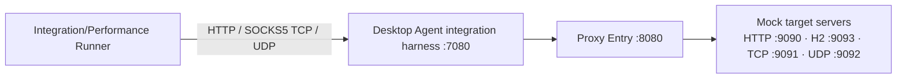
```mermaid
flowchart LR
    MockTarget["Mock target servers<br/>HTTP :9090 · H2 :9093 · TCP :9091 · UDP :9092"]
    Proxy["Proxy Entry :8080"]
    Harness["Desktop Agent integration harness :7080"]
    Runner["Integration/Performance Runner"]

    Runner -->|"HTTP / SOCKS5 TCP / UDP"| Harness
    Harness --> Proxy
    Proxy --> MockTarget
```

主要文件：

- `tests/src/mock_target/`: HTTP、TCP echo、UDP echo 目标。
- `tests/src/mock_client/`: HTTP client、SOCKS5 TCP/UDP client。
- `tests/src/integration_tests/`: 功能链路测试。
- `tests/src/performance_tests/`: 并发压测、延迟直方图、吞吐、系统指标。
- `tests/src/report/`: HTML/JSON/Markdown 报告。
- `run-tests.sh`: 启动测试工具的脚本。

典型运行顺序：

```bash
cargo build --release --workspace --locked

# 终端 1
./run-tests.sh mock-target

# 终端 2
cargo run -p proxy-entry --bin proxy-entry -- \
  --config tests/fixtures/config/proxy-entry-integration.toml

# 终端 3：启动仅供测试使用的 Agent harness
cargo run -p desktop-agent-be --features integration-test-harness \
  --bin desktop-agent-integration-harness -- \
  --config tests/fixtures/config/agent-integration.toml \
  --managed-proxy-address 127.0.0.1:8080

# 终端 4
./run-tests.sh integration
./run-tests.sh performance 100 60
```

集成测试夹具 `tests/fixtures/config/agent-integration.toml` 监听 `127.0.0.1:7080`；跑测试时要让 `AGENT_ADDR` 与该地址一致。产品流量应由 Desktop Agent UI 完成登录和配置后启动，不能将此 harness 当作生产入口。

## 18. CI 与部署

`.github/workflows/` 里主要有：

- `unit-test.yml`: Debian Bookworm，Rust 1.98；运行源码行数/Rust 测试布局/部署布局检查，构建并测试 workspace；同时测试 Registry 前端、桌面应用和 Android Agent。
- `integration-test.yml`: Debian Bookworm，Rust 1.98；启动 mock target、Proxy Entry、测试专用 Agent harness，再运行集成测试。
- `rust-clippy.yml`: Clippy SARIF 分析。
- `deploy-proxy-registry.yml`: 使用 `registry_production` Environment 部署两个 Registry 进程、前端和 Caddy。
- `deploy-proxy-entry.yml`: 使用 `entry_production` Environment 部署 1–100 个 Entry 数据面实例及其本地公开授权副本 SQLite；不接触 Registry 权威数据库。
- `checkmarx-one.yml` / `codescan.yml`: 安全/代码扫描。

完整的 GitHub Secrets、Variables 和 PEM 配置示例见
[`GITHUB_ACTIONS_DEPLOYMENT.md`](GITHUB_ACTIONS_DEPLOYMENT.md)。

部署脚本：

- `start-proxy-entry.sh`: Linux Proxy supervisor，支持 start/stop/status/restart，可 systemd 外独立守护。
- `start-proxy-registry.sh`: 启动单个 Registry 实例，分别支持公开和控制监听地址。
- `start-agent.bat`: Windows Agent；TUN 开启时安装/使用最高权限计划任务。
- `start-agent.sh` / `start-agent.command`: macOS/Linux Agent；macOS TUN helper 自动安装。

## 19. 建议阅读顺序

如果你要真正吃透项目，建议按这个顺序读：

1. `README.md`、`docs/REQUIREMENTS.md`：先知道业务目标。
2. `Cargo.toml`：看 workspace 和核心依赖。
3. `protocol/src/message/*.rs`：先看协议消息长什么样。
4. `protocol/src/codec/message_codec.rs`：理解帧、压缩和 AES 的位置。
5. `common/src/client_connection/authenticated.rs`：理解 Auth + Connect 客户端流程。
6. `proxy-entry/src/server.rs`、`proxy-entry/src/connection/auth.rs`、`proxy-entry/src/connection/connect.rs`：看 Proxy 状态机。
7. `desktop-agent-be/src/server.rs`：看本地入口如何分 HTTP/SOCKS/TUN。
8. `desktop-agent-be/src/http_handler.rs` 和 `socks5_handler.rs`：看本地代理细节。
9. `common/src/transport.rs`、`common/src/client_connection/udp.rs`、`protocol/src/udp_transport/*` 与 `desktop-agent-be/src/yamux_session/*`：分别看传输选择、原生 UDP client/packet protocol，以及 TCP/direct-framed 和 TCP-mode Yamux 流。
10. `proxy-entry/src/connection/relay.rs`、`udp_relay.rs`：看数据搬运。
11. `desktop-agent-be/src/tun_handler/*`：最后再读 TUN，因为它依赖前面所有概念。
12. `desktop-agent-ui/src-tauri/src/app.rs` 和 `agent.rs`：看 UI 如何嵌入 Agent。
13. `android-agent/native/src/netstack.rs` 和 `yamux_session.rs`：看 Android 如何复用核心。
14. `tests/src/integration_tests/`：用测试把理解闭环。

## 20. 常见容易误解的点

- Agent 本地 SOCKS5 默认无认证，不代表系统无用户认证；真正的用户认证发生在 Agent 到 Proxy。
- 全 TCP 模式的 Yamux 外层连接是 raw TCP，不再经过 PPAASS Auth/Connect；PPAASS Auth/Connect 发生在 UDP Yamux 子流内。
- `transport_mode = "udp"` 不是“所有数据走 UDP”，而是 TCP 目标继续使用 direct framed PPAASS TCP，只有代理 UDP 使用原生加密 UDP session。
- `transport_mode = "tcp"` 也不改变 TCP 目标路径，只是把代理 UDP 切换到 raw TCP/Yamux。
- `transport_mode = "auto"` 同样不改变 TCP 目标路径；每个 UDP session slot 先走原生 UDP，认证或控制超时后才在当前进程内单独改走 TCP/Yamux。
- 旧的 `transport_mode = "quic"` 与 `quic_connection_pool_size` 已移除且不会自动迁移；必须显式改为新配置。
- `quic_policy` 和 UDP/443 Version Negotiation 诊断说的是应用层 QUIC，不是 Agent→Proxy 外层。命中 `direct_access` 的 UDP 使用本地直连 socket，也不经过原生 UDP 封装。
- `Address::UdpRelay`、`Address::ProxyDns` 是协议虚拟地址，不是真实互联网目标。
- TUN 模式要先固定 proxy 控制连接的物理出口，再安装 TUN 路由。
- `direct_access` 在 TUN 模式下直接看 IP/CIDR；域名规则只在 DNS proxy 缓存命中时影响已解析 IP，不再通过 TLS SNI/HTTP Host 嗅探补充。
- Proxy 的 `compression_mode` 和 Agent 的 `compression_mode` 是 framed TCP/TCP-Yamux 上各自发送方向的编码选择；实际解码靠消息里的 compression flag。原生 UDP 始终保持数据报边界，不使用该压缩设置。

## 21. 一张压缩版端到端图

这就是整个项目的主线：入口很多，最终都收敛到“目标解析 -> 是否直连 -> Auth/Connect -> relay”。

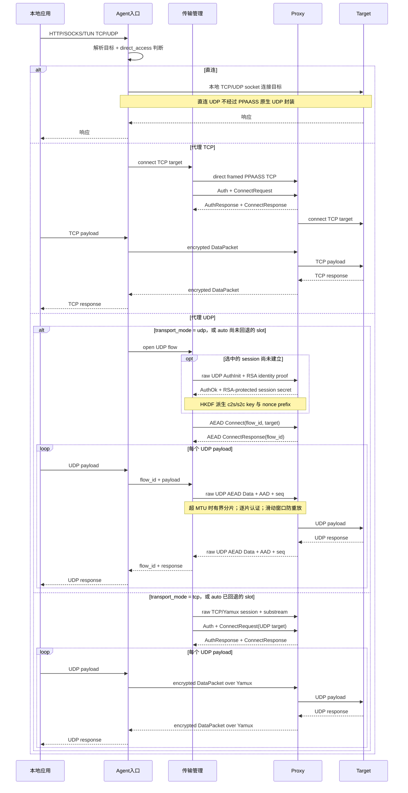
```mermaid
sequenceDiagram
    participant App as 本地应用
    participant Agent as Agent入口
    participant Transport as 传输管理
    participant Proxy as Proxy
    participant Target as Target

    App->>Agent: HTTP/SOCKS/TUN TCP/UDP
    Agent->>Agent: 解析目标 + direct_access 判断
    alt 直连
        Agent->>Target: 本地 TCP/UDP socket 连接目标
        Note over Agent,Target: 直连 UDP 不经过 PPAASS 原生 UDP 封装
        Target-->>Agent: 响应
        Agent-->>App: 响应
    else 代理 TCP
        Agent->>Transport: connect TCP target
        Transport->>Proxy: direct framed PPAASS TCP
        Transport->>Proxy: Auth + ConnectRequest
        Proxy-->>Transport: AuthResponse + ConnectResponse
        Proxy->>Target: connect TCP target
        App->>Agent: TCP payload
        Agent->>Proxy: encrypted DataPacket
        Proxy->>Target: TCP payload
        Target-->>Proxy: TCP response
        Proxy-->>Agent: encrypted DataPacket
        Agent-->>App: TCP response
    else 代理 UDP
        alt transport_mode = udp，或 auto 尚未回退的 slot
            Agent->>Transport: open UDP flow
            opt 选中的 session 尚未建立
                Transport->>Proxy: raw UDP AuthInit + RSA identity proof
                Proxy-->>Transport: AuthOk + RSA-protected session secret
                Note over Transport,Proxy: HKDF 派生 c2s/s2c key 与 nonce prefix
            end
            Transport->>Proxy: AEAD Connect(flow_id, target)
            Proxy-->>Transport: AEAD ConnectResponse(flow_id)
            loop 每个 UDP payload
                App->>Agent: UDP payload
                Agent->>Transport: flow_id + payload
                Transport->>Proxy: raw UDP AEAD Data + AAD + seq
                Note over Transport,Proxy: 超 MTU 时有界分片；逐片认证；滑动窗口防重放
                Proxy->>Target: UDP payload
                Target-->>Proxy: UDP response
                Proxy-->>Transport: raw UDP AEAD Data + AAD + seq
                Transport-->>Agent: flow_id + response
                Agent-->>App: UDP response
            end
        else transport_mode = tcp，或 auto 已回退的 slot
            Transport->>Proxy: raw TCP/Yamux session + substream
            Transport->>Proxy: Auth + ConnectRequest(UDP target)
            Proxy-->>Transport: AuthResponse + ConnectResponse
            loop 每个 UDP payload
                App->>Agent: UDP payload
                Agent->>Proxy: encrypted DataPacket over Yamux
                Proxy->>Target: UDP payload
                Target-->>Proxy: UDP response
                Proxy-->>Agent: encrypted DataPacket over Yamux
                Agent-->>App: UDP response
            end
        end
    end
```
