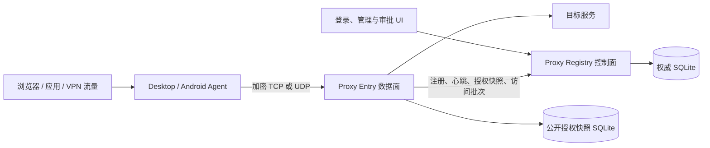

# PPAASS 项目摘要

本文是 PPAASS 的当前架构与能力摘要，不是一次性“已完成”或构建状态报告。具体行为应以
源码、CI 和下列专题文档为准。

## 一句话说明

PPAASS 是一个受管的 Rust 加密代理系统：Desktop/Android Agent 接收本地代理或 VPN/TUN
流量，Proxy Entry 完成认证与目标 relay，Proxy Registry 负责账户、设备、密钥、授权、
Entry 目录和访问记录。

## 当前组件

| 组件 | 目录 | 责任 |
| --- | --- | --- |
| Desktop Agent backend | `desktop-agent-be/` | HTTP/SOCKS5、TUN、direct-access、传输管理、TUN/DNS/PCAP 支撑 |
| Desktop UI | `desktop-agent-ui/` | Tauri 2 + Vue 3 登录、配置、诊断、流量和抓包界面；嵌入 Agent 后端 |
| Android Agent | `android-agent/` | Android UI、`VpnService`、JNI 和 Rust native TUN/代理实现 |
| Proxy Entry | `proxy-entry/` | TCP/raw UDP 接入、用户认证、目标 TCP/UDP/DNS relay、授权快照与访问批次 |
| Proxy Registry | `proxy-registry/` | Axum API、账户/设备/密钥/权限、Entry 目录、审计、Vue 管理前端 |
| Control protocol | `proxy-control-protocol/` | Registry–Entry HTTP/SSE 的版本化 DTO 与路径契约 |
| Data protocol | `protocol/` | 流消息、编解码、压缩、加密和原生 UDP packet protocol |
| Shared utilities | `common/` | Agent/Entry 共用的连接、传输策略、Yamux 和网络工具 |
| Test tools | `tests/` | Mock target、集成/性能测试、吞吐报告 |

## 流量与控制面边界

- TCP 目标始终采用独立的 direct framed PPAASS TCP 连接；`transport_mode` 不会将 TCP
  目标切到 UDP 或 Yamux。
- 代理 UDP 支持三种策略：`udp`（原生认证加密 UDP）、`tcp`（raw TCP/Yamux）、`auto`
  （每个 session slot 先尝试原生 UDP，在认证或控制超时后仅该 slot 回退 TCP/Yamux）。
- `direct_access` 命中的 TCP/UDP 使用 Agent 本地受保护 socket 直接出站，不进入 PPAASS
  封装。
- Desktop TUN 与 Android `VpnService` 通过 `netstack-smoltcp` 处理 IP 流量；代理 DNS、
  普通 UDP、UDP/443 QUIC 和抓包分别受独立策略控制。
- Registry 绝不承担代理数据流，也不向 Entry 共享权威用户数据库。Entry 只保存经 HTTP/SSE
  同步、可用于认证的公开授权 last-known-good SQLite 副本。

## 关键技术与算法

| 范围 | 当前实现 |
| --- | --- |
| 异步与网络 | Tokio、Hyper、fast-socks5、Tokio Yamux、`tokio-util` framed codec |
| 数据面加密 | 流式 Auth/Connect/Data、AES-GCM、压缩（none/LZ4/gzip/zstd） |
| 原生 UDP | RSA 身份证明与 session secret 保护、HKDF 双向 key/nonce prefix、AES-256-GCM、固定头 AAD、序号/滑动重放窗口、有界分片重组 |
| 身份与凭据 | Argon2id 密码哈希、HttpOnly Web session、CSRF、RSA 密钥版本化、AES-GCM 加密托管私钥、Agent Bearer Token 与 SSE 同步 |
| 存储 | SQLite、版本迁移、事务、授权 staging/原子替换、访问批次幂等键 |
| TUN 与平台 | `tun-rs`、`netstack-smoltcp`、Android JNI/`VpnService`、macOS helper、Windows 计划任务 |
| 可观测性 | `tracing`、SSE、运行时诊断、PCAP（DLT_RAW）、性能直方图与 HTML/JSON/Markdown 报告 |

算法、参数、协议包格式、数据库表和 ER 图见
[技术架构与实现细节](TECHNICAL_DETAILS.md)。

## 安全与可用性原则

- 用户私钥由受管 Agent 原生后端领取、校验和按平台权限保存，不返回 WebView，不记录到日志。
- 原生 UDP 按数据报独立认证；它允许有限乱序，但不额外提供可靠重传或有序字节流语义。
- Entry 在拿到第一份完整授权快照前 fail closed；随后 Registry 短暂不可达时可继续使用最后
  成功快照，恢复后整体应用授权变更。
- Registry 的私钥加密主密钥必须跨重启、升级与迁移保持不变；丢失或替换它会导致历史托管
  私钥无法解密。
- 生产部署使用 Caddy HTTPS、systemd 沙箱、服务专用账号、主机/云防火墙和 GitHub
  Environment 共同保护。当前 Entry 控制客户端会接受无效 Registry 证书，生产网络和
  Caddy 证书配置应额外审查这一边界。

## 开发、测试与发布

| 场景 | 入口 |
| --- | --- |
| 本地构建 | `cargo build --workspace --all-targets --release --locked` |
| Rust 验证 | `cargo test --workspace --locked` |
| 结构/部署契约 | `./scripts/check-source-line-limits.sh`、`bash ./scripts/test-proxy-deployment-layout.sh` |
| 本地 Agent–Entry–mock 端到端 | [测试指南](TESTING.md#4-本地端到端测试) |
| 前端与 Android 验证 | [测试指南](TESTING.md) |
| 本地开发环境 | [搭建指南](SETUP.md) |
| Registry/Entry 生产发布 | [GitHub Actions 部署](GITHUB_ACTIONS_DEPLOYMENT.md) |

CI 包含 Rust workspace、Registry 前端、桌面 Windows/macOS、Android、端到端集成和安全扫描。
部署工作流与完整测试工作流分离：发布会构建 release 并校验部署输入/脚本，不能代替合并前
测试。

## 文档导航

- [README](../README.md)：项目入口、快速开始、配置要点和全部文档索引。
- [搭建指南](SETUP.md)：本机 Registry、Entry 与 Desktop Agent 的开发环境步骤。
- [功能需求与现有能力](REQUIREMENTS.md)：用户、管理员、代理、TUN、平台和部署能力。
- [技术架构与实现细节](TECHNICAL_DETAILS.md)：实现、算法、时序、数据库和 ER 图。
- [项目学习导览](PROJECT_WALKTHROUGH.md)：按主链路阅读源码的 Mermaid 流程图导览。
- [测试指南](TESTING.md)：CI、端到端、性能、QUIC 和 Android 测试。
- [GitHub Actions 部署](GITHUB_ACTIONS_DEPLOYMENT.md)：生产配置、实现拓扑、验收和回滚。
- [Proxy Registry 说明](../proxy-registry/README.md)、[Android Agent 说明](../android-agent/README.md)、[测试工具说明](../tests/README.md)。

## 维护约定

- 功能或架构变更时，同步更新 `README.md`、本摘要与受影响的专题文档；不把一次测试结果或
  某次构建状态写成永久结论。
- 详细 Mermaid 图直接维护在[项目学习导览](PROJECT_WALKTHROUGH.md)，不再维护单独的
  `docs/diagrams/` 副本。
- Rust 测试必须在所属 crate 顶层 `tests/` 目录，并通过公开 API 验证生产代码；提交前运行
  仓库结构检查。
