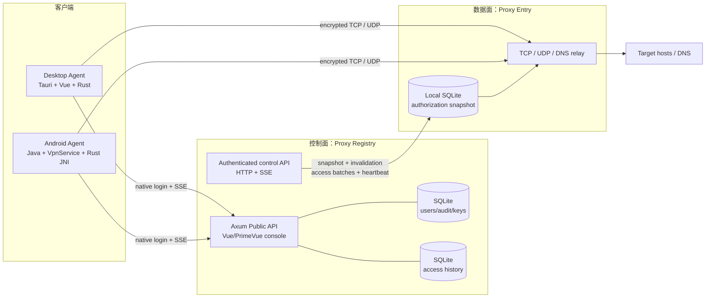
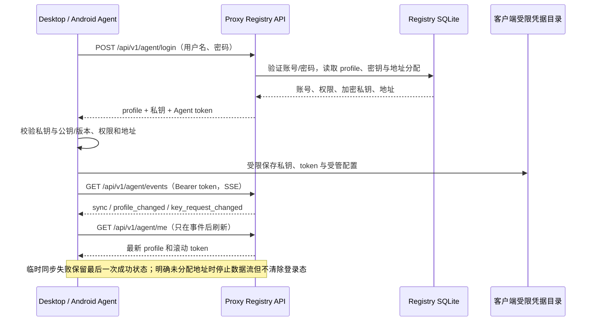
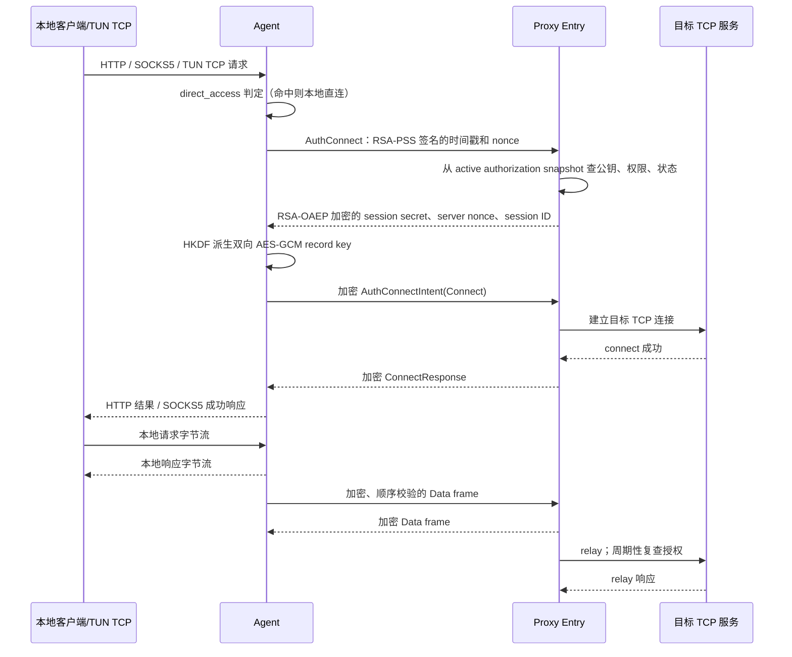
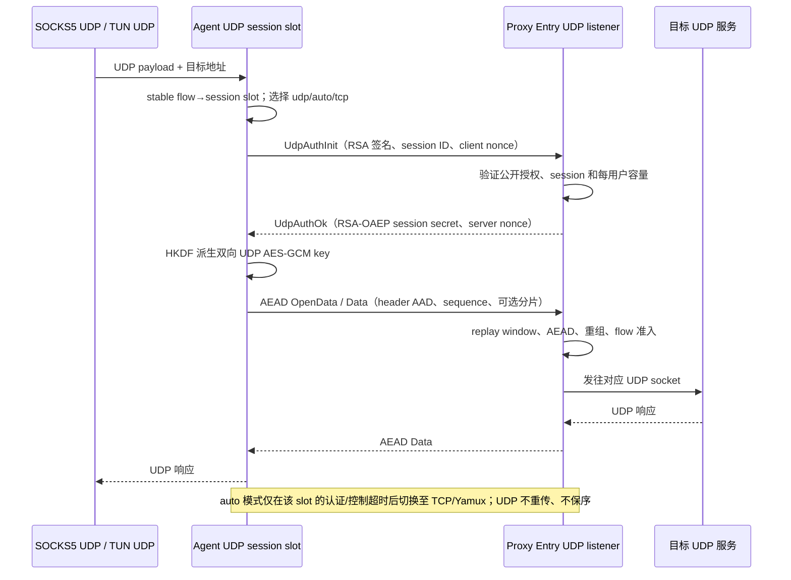
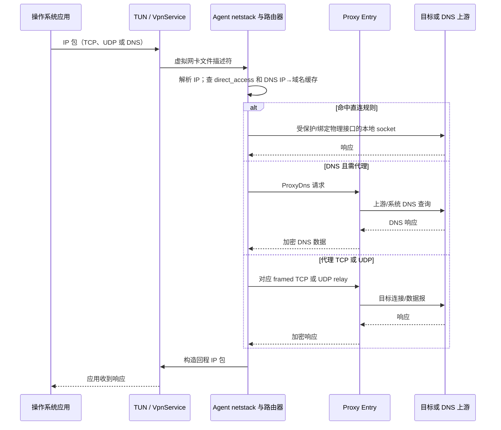
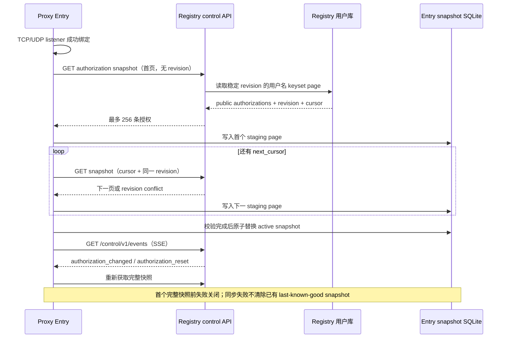
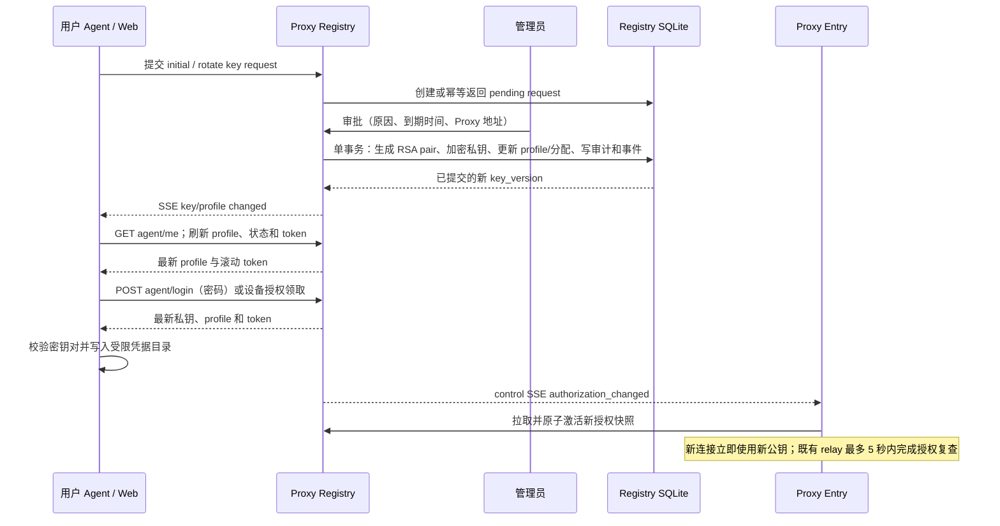
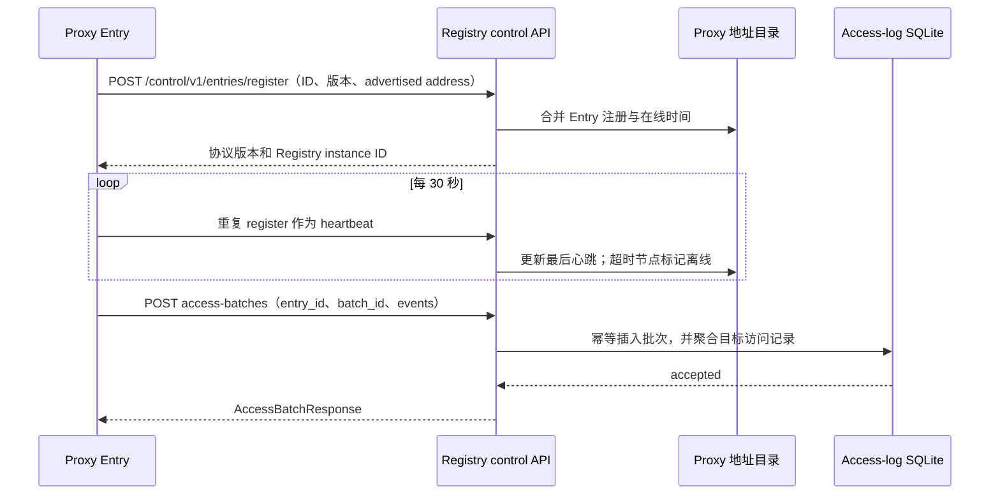
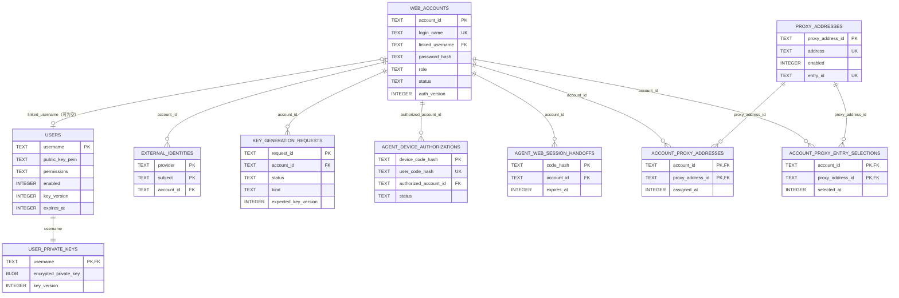
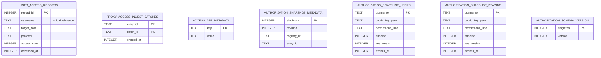

# PPAASS 技术架构与实现细节

> 本文记录当前仓库的实现结构和运行边界（截至 2026-09-13）。面向产品能力的汇总见 [REQUIREMENTS.md](REQUIREMENTS.md)；部署操作见 [GITHUB_ACTIONS_DEPLOYMENT.md](GITHUB_ACTIONS_DEPLOYMENT.md)。

## 1. 系统总览

系统刻意将“控制面权威数据”和“数据面可用性”分开：Registry 独占账号和访问数据库；Entry 只保存公开授权的本地副本。这样 Entry 首次取得完整快照前拒绝流量，之后即使 Registry 暂时不可用也能以最后一次成功快照继续服务。

## 2. 仓库与技术栈

| 目录/包 | 主要职责 | 关键技术 |
| --- | --- | --- |
| `protocol` | Agent–Entry 消息、编解码、TCP/UDP 加密传输 | Rust、serde/bitcode、tokio-util codec、RSA、AES-GCM、HKDF |
| `common` | 客户端认证连接、Yamux、DNS、socket 绑定、TUN 控制和 tracing | Tokio、tokio-yamux、socket2 |
| `desktop-agent-be` | Desktop 本地代理、TUN、直连和抓包 | Tokio、Hyper、fast-socks5、tun-rs、netstack-smoltcp |
| `desktop-agent-ui` | Windows/macOS 桌面壳和管理界面 | Tauri 2、Vue 3、TypeScript、PrimeVue |
| `android-agent` | Android VPN/显式代理、登录和原生桥接 | Java、`VpnService`、JNI、Rust cdylib |
| `proxy-entry` | 数据面认证、目标连接、中继、快照同步和访问上报 | Tokio、Tokio Yamux、Reqwest、SQLx/SQLite |
| `proxy-registry` | 账号/密钥/节点/审计/访问控制面和 Web UI | Axum、SQLx/SQLite、Argon2id、Vue 3、PrimeVue |
| `proxy-control-protocol` | Entry–Registry 控制面 DTO、路径与版本常量 | Rust、serde |
| `tests` | mock target/client、集成测试、负载与报告 | Tokio、Ratatui、hdrhistogram、sysinfo |

根 `Cargo.toml` 使用 Rust 2024 edition，集中维护依赖；release profile 启用 `opt-level=3`、fat LTO 和单 codegen unit。可选 `mimalloc` 是 Desktop Agent 和 Entry 的默认分配器特性。

## 3. 关键技术与算法

本节列出实际参与运行路径的关键技术。具体的组件归属、消息字段与安全边界仍以本文后续章节和源码为准。

### 3.1 并发、网络与客户端平台

| 技术/算法 | 使用位置 | 作用与实现要点 |
| --- | --- | --- |
| Tokio async runtime | 全部 Rust 服务 | 基于异步 I/O 的 TCP/UDP listener、定时任务、channel 和任务取消；Agent、Entry 的 worker 数、栈大小和超时可配置。 |
| `tokio-util` `Framed` + `LengthDelimitedCodec` | TCP direct 与 Yamux 子流 | 用长度前缀分隔 record，避免 TCP 粘包/拆包影响业务消息边界。 |
| Tokio Yamux | UDP 的 `tcp`/`auto` 回退路径 | 在一条 raw TCP 连接上按需打开多个业务子流；限制 session、子流数、流窗口、写超时和 keepalive。 |
| Hyper 与 fast-socks5 | Desktop/Android 显式代理入口 | 处理 HTTP absolute-form/CONNECT、SOCKS5 CONNECT；Desktop 额外实现 UDP ASSOCIATE。 |
| `tun-rs` + `netstack-smoltcp` | Desktop TUN、Android native | 从虚拟网卡 IP 包构造用户态 TCP/UDP 会话，并把回包写回 TUN。 |
| JNI + Android `VpnService` | Android | Java 管理 VPN 生命周期、应用 allow-list 和 `protect()`；Rust 通过 `AsyncFd` 高效读写 VPN 文件描述符。 |
| Happy Eyeballs 地址交错 | 目标 TCP 连接 | `common::direct_tcp` 交错 IPv6/IPv4 地址的尝试顺序，降低单一地址族不可达时的连接等待。 |
| `socket2`/系统路由接口 | 直连和 TUN 保护 | 将直连、DNS 和控制 socket 绑定到正确物理网络路径，避免 VPN/TUN 回环。 |

### 3.2 密码学与传输安全

| 技术/算法 | 使用位置 | 作用与实现要点 |
| --- | --- | --- |
| RSA-PSS-SHA256 | TCP、Yamux 与原生 UDP 认证首包 | Agent 对带版本、用户名、时间戳和 client nonce 的域分隔 transcript 签名；Entry 以 Registry 快照中的公钥验证身份。 |
| RSA-OAEP-SHA256（带协议标签） | 会话密钥下发 | Entry 为每次认证生成 32-byte session secret，并只加密给已验证用户的公钥；Entry 不保存通用传输私钥。 |
| HKDF-SHA256 | TCP 与 UDP session | 将 master secret、session ID、client/server nonce 与 TCP transcript hash 绑定，派生严格分离的双向 AES key 与 nonce prefix。 |
| AES-256-GCM / AEAD | framed TCP 与原生 UDP payload | 为每个方向和每条记录/数据报提供保密性和完整性。版本、方向、消息类型、压缩标志和序号等元数据置入 AAD，不能被篡改而不被发现。 |
| 单调 sequence + nonce 构造 | 两类加密传输 | nonce 由 4-byte 方向前缀和 64-bit sequence 组成；sequence 耗尽会关闭该安全通道，防止 AES-GCM nonce 重用。 |
| 滑动 replay window | 原生 UDP | 4096 项窗口接受受限乱序，却拒绝重复包与过旧包；TCP 则要求严格的下一条 sequence。 |
| 有界分片/重组 | 原生 UDP | 将最多 70 KiB 的协议消息拆成最多 64 个独立 AEAD 认证分片；限制每条 session 的重组数量、字节数和超时，防止碎片占用资源。 |
| Argon2id + AES-256-GCM at rest | Registry | Argon2id 存口令哈希；部署主密钥派生的 AES-GCM key 保护数据库中的托管私钥和 Agent access token。 |

### 3.3 编解码、路由与 DNS

| 技术/算法 | 使用位置 | 作用与实现要点 |
| --- | --- | --- |
| serde + bitcode | PPAASS 业务消息与 UDP payload | 将 `AuthConnect`、`Connect`、`Data`、`UdpRelayPacket` 等强类型 DTO 编码为紧凑二进制消息。 |
| none / LZ4 / gzip / Zstd | framed TCP/TCP-Yamux | 记录层可选压缩；原生 UDP 为避免额外延迟、MTU 变化和压缩副作用，不使用该路径。 |
| 规则匹配 | `direct_access` | 先按模式决定 proxy/direct，再以精确域名、通配符后缀、精确 IP 或 CIDR bitmask 匹配；TUN 可由 DNS IP→域名缓存补足已解析 IP 的域名规则判定。 |
| DNS 代理与缓存 | TUN / Entry | Agent 识别 DNS 请求；直连规则命中时经受保护 socket 查询，否则以 `ProxyDns` 发往 Entry。DNS 回应摘要和域名映射可用于界面与路由判断。 |
| QUIC UDP/443 策略 | TUN | 独立于外层 transport：允许时按直连规则或 UDP relay 分流，阻断时让应用回退 TCP/TLS。 |

### 3.4 一致性、限流与可观测性算法

| 技术/算法 | 使用位置 | 作用与实现要点 |
| --- | --- | --- |
| revision + keyset pagination | Registry → Entry 授权快照 | 按规范化用户名游标而非 offset 分页；固定 revision 保证一轮快照一致，遇 revision 冲突从首页重新开始。 |
| staging + atomic replace | Entry 本地授权数据库 | 每页先写 staging，只有同一 revision 的全部页面校验通过才替换 active snapshot；失败不会破坏 last-known-good。 |
| SQL transaction + audit | Registry 敏感写操作 | 账户、密钥、地址、权限更新与审计事件在同一仓储事务提交，避免业务状态和审计记录分离。 |
| 幂等键与 UPSERT 聚合 | Entry 访问历史上报 | `(entry_id, batch_id)` 阻止 HTTP 重试重复计数；`(username, target_host)` 聚合访问次数和最近端口/协议/时间。 |
| SSE publish/subscribe + 指数退避 | Agent 与 Entry 同步 | Registry 发送失效事件和 keep-alive；客户端遇断线按 1–60 秒退避，lagged subscriber 通过 reset/sync 恢复一致状态。 |
| 有界 queue、容量准入与超时 | Entry relay / capture writer | 对 UDP session、flow、目标 socket、channel 和分片重组预先检查预算；拥塞时按 UDP 语义丢弃新包或新 flow，而非无界分配。 |
| PCAP 尾部修复与 TCP 流重组 | Desktop/Android 抓包 | 追加前扫描到最后一条完整记录；解析侧按五元组、TCP sequence 和重叠区间重组有限流，再识别 HTTP/TLS/DNS/QUIC 摘要。 |

## 4. 客户端运行结构

### 4.1 Desktop Agent

Desktop UI 的 Vue 层位于 `desktop-agent-ui/src/`，Tauri/Rust 壳位于 `desktop-agent-ui/src-tauri/src/`。Tauri 后端负责：

- 从本地受管配置读取 Registry URL，调用原生登录 API，保存受限的私钥和 Agent token；Vue WebView 不接触密码、cookie、token 或 PEM。
- 依据账号权限对命令和配置做二次校验，启动/停止 `desktop-agent`，并推送状态、日志、流量和 DNS 记录给 UI。
- 解析 PCAP，以协议层、方向、端点、流重组及 HTTP/TLS/DNS/QUIC 摘要呈现抓包数据。
- 提供前台/托盘控制、诊断、Entry 选择和加密测速；TUN 在 macOS 可交给特权 helper，Windows 有服务运行支持。

`desktop-agent-be` 的 `AgentServer` 将本地 TCP 首包分流至 HTTP 或 SOCKS5 handler。HTTP CONNECT、普通 HTTP 和 SOCKS5 TCP 都建立到 Entry 的独立 TCP 代理连接；Desktop SOCKS5 UDP ASSOCIATE、TUN UDP 和 Proxy DNS 复用 UDP relay 语义。TUN 部分在 `tun_handler/` 中处理设备、路由保护、DNS、TCP/IP 用户态网络栈、直连 UDP 及 PCAP writer。

### 4.2 Android Agent

Android Java 层通过 `PpaassVpnService` 建立 TUN，并把 detach 后的文件描述符交给 `android-agent/native`。Rust JNI 层用 `AsyncFd` 接入文件描述符，再用 `netstack-smoltcp` 将 IP 包还原为 TCP stream 和 UDP session；协议/中继代码复用 `common` 与 `protocol`。

- `PpaassHttpProxyService` 提供显式 HTTP/SOCKS5 入口；SOCKS5 在 Android 只实现 TCP CONNECT。
- `VpnService.protect()` 保护 Agent 自身的控制和直连 socket，防止连接进入自己的 VPN 回环。
- Android 13+ 可将 `direct_all` 与固定 IP/CIDR 规则编译为 VPN 排除路由；域名规则及低版本使用受保护本地 socket。
- 登录、SSE 状态同步、托管私钥、代理地址、权限强制、抓包、应用选择、Always-on VPN 与 mock GEO 主要位于 `android-agent/app/src/main/java/com/ppaass/ai/agent/`。

## 5. 数据面：从流量到目标

### 5.1 协议选择

| 上层目标 | Agent–Entry 外层 | 说明 |
| --- | --- | --- |
| HTTP、SOCKS5 CONNECT、TUN TCP | direct framed TCP | 每个 TCP 目标独立认证、连接与双向 relay；不受 `transport_mode` 影响。 |
| UDP（`udp`） | 原生认证加密 UDP session | flow 稳定映射到 1–8 个 session 中的一个；无可靠排序/重传。 |
| UDP（`tcp`） | raw TCP + Yamux business stream | 按需创建外层连接，在子流上完成同样的认证/Connect/Data 语义。 |
| UDP（`auto`） | 先原生 UDP，单 slot 回退 TCP/Yamux | 某一 session 的控制/认证超时不影响其他 session。 |
| 命中 `direct_access` | Agent 本地受保护 socket | 直接连接目标，不进入 PPAASS 封装。 |

`protocol::Address` 可表示域名、IPv4、IPv6、`ProxyDns` 与共享 `UdpRelay`；`ConnectRequest` 指明 TCP 或 UDP。域名以域名形式发送给 Entry，由其使用配置的上游或系统 DNS 解析。共享 UDP relay 的 `UdpRelayPacket` 以 `flow_id + address + payload` 表示内层流。

### 5.2 Entry 运行时

`proxy-entry/src/server.rs` 在 `listen_addr` 的同一数值端口绑定 TCP 和 raw UDP。TCP listener 区分 direct framed TCP 与 raw Yamux；UDP listener 负责认证、session 定位、反重放、重组和 flow 分派。认证完成后，`connection/` 模块按目标类型进入：

- TCP relay：Entry 建立目标 TCP 连接，以双向复制和半关闭/空闲控制转发；支持可选出站网卡绑定和 Happy Eyeballs 连接。
- 单目标 UDP：一个请求对应一个已连接的目标 UDP socket。
- 共享 UDP relay：一个 relay 维护许多 flow/目标 socket，以 flow ID 隔离，超时回收空闲 flow。
- Proxy DNS：Entry 使用配置的 DNS 上游或系统 DNS 处理请求。
- Speed test：认证后的受限测试流返回随机数据，不连接第三方目标。

Entry 会在 authenticated relay/session 中至多每 5 秒重新查询本地授权快照。因此账号/资料禁用、权限撤销、密钥轮换及到期可终止已有数据流，而不只是阻止新建连接。

## 6. Agent–Entry 安全协议

### 6.1 TCP 与 Yamux 子流

认证和记录层由 `protocol/src/tcp_transport/` 及 `common/src/client_connection/authenticated/` 实现。

1. Agent 生成 client nonce 和时间戳，并用自己的 RSA 私钥对含版本、用户名、时间戳和 nonce 的域分隔 transcript 进行 RSA-PSS-SHA256 签名。
2. Entry 从公开授权快照找到用户公钥，验证签名、新鲜度和 replay key。只有完成身份验证后，已知的停用/到期可返回指定终态；其余认证失败统一处理。
3. Entry 生成 32 字节 master secret、server nonce 和 session ID，用用户公钥的带标签 RSA-OAEP-SHA256 加密 session secret 后返回。
4. 双方用 HKDF 绑定 transcript hash、两个 nonce 和 session ID，派生 Agent→Entry、Entry→Agent 两套 AES-256-GCM key 与 nonce prefix。
5. 后续长度定界 frame 使用严格的单调序号和包含方向、消息类型、压缩标记、序号的 AAD 进行 AEAD 保护。TCP frame 顺序不符会失败关闭。

`MessageCodec` 基于 `LengthDelimitedCodec`，以 bitcode 序列化消息，并支持 none/lz4/gzip/zstd 压缩。压缩适用于 framed TCP/TCP-Yamux，不适用于原生 UDP。

### 6.2 原生 UDP session

原生 UDP 实现在 `protocol/src/udp_transport/`，与有序 TCP record layer 分离：

1. Agent 用 RSA 身份签名的认证初始包证明私钥持有，并提交 session ID、时间戳和 client nonce。
2. Entry 生成 master key 与 server nonce，用用户公钥以带标签 RSA-OAEP 加密 session secret 回传。
3. HKDF 派生双向 AES-256-GCM key 和 nonce prefix。每个 datagram 的固定头携带 magic `PUDP`、版本、kind、session ID、sequence、message/fragment 元数据和总长度；完整头部是 AAD。
4. 每个方向独立递增 sequence。4096 项滑动 replay window 容忍有限乱序，同时拒绝重复与过旧包。
5. 单个完整 datagram 最大 1351 bytes；超过时最多拆为 64 个独立认证片段，完整消息上限 70 KiB。Entry 对未完成重组另设条目数、字节数和超时限制。

原生 UDP 外层只提供认证、保密、有限乱序接收和分片重组；不模拟可靠字节流，也没有重传机制。

### 6.3 容量与失败保护

`ProxyConfig` 对 relay queue、共享 UDP relay 内层 flow、全局 native UDP session、每用户名 session、每 session datagram queue 和外层 flow 都设有上限。达到上限时，已经存在的 flow 的重复 Connect 保持幂等；新的 flow 会在创建 socket 或 worker 前被拒绝。默认值包括 4096 个 native UDP session、每用户 64 个、每 session 256 个队列项/flow，以及共享 relay 256 个内层 flow。

## 7. 控制面与持久化

### 7.1 Registry 公共 API

`proxy-registry` 同时提供 Axum API 和静态托管的 `proxy-registry/frontend`。公共 API 根为 `/api/v1`，主要分组是：

| 路径组 | 作用 |
| --- | --- |
| `/auth/*`、`/session` | 注册、浏览器登录/退出、CSRF 和 Agent 到 Web 的一次性交接。 |
| `/agent/*` | 原生 Agent 登录、Bearer token 刷新、SSE、可选设备授权和 Entry 选择。 |
| `/me/*` | 个人资料、密码、托管私钥领取、密钥操作与个人访问记录。 |
| `/admin/*` | 用户、密钥申请、Proxy 地址、访问保留期和审计管理。 |
| `/healthz` | 健康检查。 |

账号仓储以 `UserRepository`、`AccountRepository`、`ProxyAddressRepository`、`AccessLogRepository` 等 trait 定义，当前 SQLx adapter 是 SQLite。用户/密钥/审批/地址/审计及 Agent event 使用一个用户数据库；访问记录使用独立 SQLite 数据库，按用户和目标聚合并按保留期清理。

私钥在入库前使用部署主密钥派生的 AES-256-GCM 保护。密码用 Argon2id；浏览器 session 是服务端保存的不透明 token，cookie 为 HttpOnly，修改请求需 CSRF token。Agent access token 同样用独立派生的 AES-256-GCM key 加密认证。

### 7.2 Entry 控制 API

`proxy-control-protocol` 当前版本为 4，定义无存储依赖的 DTO 与契约。Registry control listener 需要 Bearer token，提供：

| 路径 | Entry 使用方式 |
| --- | --- |
| `GET /control/v1/health` | 健康与协议版本核对。 |
| `POST /control/v1/entries/register` | 上报 Entry ID、版本、协议版本和公开地址；后续心跳维持在线状态。 |
| `GET /control/v1/authorizations/snapshot` | 拉取公开授权快照。使用 revision + `after_username` 游标，单页最多 256 条。 |
| `GET /control/v1/events` | SSE 授权变更/重置通知，促使 Entry 完整刷新。 |
| `POST /control/v1/access-batches` | 以 `(entry_id, batch_id)` 幂等提交最多 200 条访问事件。 |

Entry 将同一 revision 的分页数据写入 staging table，只有所有页面成功后才原子替换 active snapshot。revision 冲突从首页重试，失败/半成品绝不清空 active snapshot。快照只存用户名、公钥、权限、启用状态、密钥版本和到期时间，不含密码、私钥或 Agent token。

### 7.3 客户端同步和凭据

Agent 使用 `/api/v1/agent/login` 直接进行原生密码认证，成功后保存受管私钥、token、身份及地址。随后连接 `/api/v1/agent/events`；初始 `sync`、资料/权限/密钥申请变更触发 `GET /api/v1/agent/me` 按需刷新，而不是固定业务轮询。SSE 每 15 秒 keep-alive，服务器约 12 小时关闭一次，客户端以 1–60 秒指数退避重连。

Desktop 在 per-user app-data 目录保存凭据（Unix 目录 0700、私钥 0600）；Android 保存到 app-private no-backup 路径并以长度和 SHA-256 摘要校验。两端均拒绝让 UI 编辑身份、私钥或 Proxy 地址。

## 8. 配置、网络与可观测性

### 8.1 主要配置

`desktop-agent-be/src/config/agent_config.rs` 定义 `agent.toml`：本地监听、Registry URL、受管用户名/私钥路径、传输模式、UDP session 池、超时、压缩、Yamux、日志、runtime 线程、direct-access 与 TUN。`proxy-entry/src/config/proxy_config.rs` 定义 `proxy-entry.toml`：监听/公开地址、Registry 控制 URL/token、授权副本路径、TLS/relay/session/queue 限额、DNS、出站网卡、超时、压缩和 runtime。

产品运行的 Proxy 地址只能来自 Registry。`agent.toml` 中的旧 `proxy_addrs` 与公共 `--proxy` 均被拒绝；显式地址只存在于 CI `desktop-agent-integration-harness`。

### 8.2 日志、遥测与抓包

所有 Rust 服务使用 `tracing`；Desktop Agent 与 Entry 支持非阻塞文件 appender。Desktop 后端维护流量快照和 DNS resolution record，UI 据此显示状态。PCAP 写入走专用缓冲 writer 和有界、非阻塞复制队列，以不牺牲转发吞吐为前提。

PCAP 文件为 DLT_RAW：TUN 记录真实 IP 包；显式 HTTP/SOCKS5 连接生成仅用于 PCAP 的合成 raw IP/TCP 包。Tauri 后端可重组 TCP 流并解析有限的 HTTP、TLS、DNS 和 QUIC 元信息；应用 TLS payload 不会因抓包而被解密。

## 9. 生产拓扑、构建与验证

生产 Registry 默认有两个进程，共享本机 SQLite 文件：公共监听通常为 `127.0.0.1:8787/8788`，控制监听为 `127.0.0.1:8797/8798`。Caddy 终止 HTTPS，公共 Web/API 使用 cookie 粘性负载均衡以匹配进程内 Web session；无状态 control API 可随机负载均衡。跨主机扩展 Registry 需要用中央数据库替换 SQLite。

Entry 是独立数据面服务：部署时不连接 Registry、不安装 Caddy、不读取 Registry SQLite；启动监听成功后自行注册并重试心跳。部署脚本在 `deploy/proxy-entry/` 和 `deploy/proxy-registry/`，GitHub Actions 分别由 `deploy-proxy-entry.yml` 与 `deploy-proxy-registry.yml` 手动触发。

质量门包括：

- `scripts/check-source-line-limits.sh`：受管源码/配置文件不超过 400 物理行。
- `scripts/check-rust-test-layout.sh`：Rust 测试仅在 crate 顶层 `tests/`，并通过公开 API 测试生产代码。
- `cargo test --workspace --locked`：协议、控制面、Entry、Registry、Agent 及集成测试。
- `run-tests.sh`：启动 mock target，运行端到端/性能/最高吞吐场景，生成 HTML、JSON、Markdown 报告。
- GitHub Actions：unit、integration、clippy、前端、Desktop、Android 构建/测试，以及 CodeScan/Checkmarx 扫描。

## 10. 维护导航

| 想修改的领域 | 优先阅读 |
| --- | --- |
| TCP/UDP 线协议或密钥派生 | `protocol/src/tcp_transport/`、`protocol/src/udp_transport/`、`protocol/src/message/` |
| Agent 到 Entry 的会话建立 | `common/src/client_connection/`、`desktop-agent-be/src/yamux_session/`、`proxy-entry/src/connection/` |
| 入口协议、TUN、直连与抓包 | `desktop-agent-be/src/server.rs`、`http_handler.rs`、`socks5_handler.rs`、`tun_handler/` |
| Entry 授权、UDP session、控制同步 | `proxy-entry/src/control_plane/`、`native_udp/`、`user_manager.rs` |
| Registry 业务/API/迁移 | `proxy-registry/src/api/`、`store/repository.rs`、`store/sqlite/` |
| Desktop 体验/原生命令 | `desktop-agent-ui/src/`、`desktop-agent-ui/src-tauri/src/` |
| Android UI、VPN 和 JNI | `android-agent/app/src/main/java/`、`android-agent/native/src/` |
| 部署和 CI | `deploy/`、`.github/workflows/`、`docs/GITHUB_ACTIONS_DEPLOYMENT.md` |

## 11. 关键流程时序图

### 11.1 原生登录、凭据落盘与实时同步

### 11.2 TCP 目标的认证、连接和双向 relay

### 11.3 原生 UDP session、流建立和自动回退

### 11.4 TUN / DNS / 直连分流

### 11.5 Entry 授权快照同步与故障恢复

### 11.6 密钥审批、客户端更新与数据面生效

### 11.7 Entry 注册、心跳和访问记录上报

## 12. 当前实现注意事项

- `Proxy Registry` 的 HTTPS 客户端在当前 Desktop 与 Android Agent 中明确跳过证书链和主机名验证；这不改变进程全局 TLS 配置，但生产网络仍应通过受信任 HTTPS 反向代理和访问控制保护。
- Registry 的私钥加密主密钥必须与数据库成组备份；丢失该主密钥将无法解密已有的托管私钥。
- 原生 UDP、TCP framed 和 TCP/Yamux 是不同的协议路径。修改任一条路径时必须保持各自的认证、授权重查、容量限制和集成测试覆盖，不能假定 UDP 可被抽象成有序可靠 stream。

## 13. SQLite 表结构与 ER 图

系统使用三个相互隔离的 SQLite 文件。Registry 用户库当前 schema version 是 15，Registry 访问记录库为 2，Entry 本地授权快照库为 1。下列内容按当前 migration 定义整理；时间字段均为 Unix timestamp（秒），布尔值以 `INTEGER 0/1` 保存。

| 数据库 | 所有者 | 文件/配置 | 用途 |
| --- | --- | --- | --- |
| Registry 用户库 | `proxy-registry` | `--database`，默认 `data/proxy-users.sqlite3` | 账号、公开授权、公钥、加密私钥、分配、审批、审计及事件。 |
| Registry 访问库 | `proxy-registry` | `--access-log-database`，默认 `data/proxy-access.sqlite3` | 聚合后的访问历史和 Entry 接收批次；必须与用户库是不同文件。 |
| Entry 授权副本 | `proxy-entry` | `authorization_database_path` | 活跃/暂存的公开授权快照；不保存密码、私钥、浏览器会话或 access token。 |

三个数据库均不允许其他服务直接作为权威来源：Entry 通过 control API 填充自己的副本；访问库以 `username` 作为逻辑关联，故意没有跨文件外键。Registry 用户库以 WAL、外键检查和 `BEGIN IMMEDIATE` migration 运行；访问库也使用 WAL，并开启 `secure_delete`。

### 13.1 Registry 用户库的核心 ER 图

`web_accounts.linked_username` 和 `users.username` 是可选的一对一关系：新注册的 Web 账号可在尚未审批密钥时没有 Proxy profile；初始申请获批后，账号、profile 和加密私钥会在一个事务中绑定。`account_proxy_entry_selections` 记录用户从“管理员已分配地址”中选择的子集；其“必须属于分配集合”的约束由 Repository 事务与迁移校验维护，而不是独立复合外键。

### 13.2 Registry 用户库表说明

| 表 | 主键/外键 | 关键列 | 用途与关键约束/索引 |
| --- | --- | --- | --- |
| `app_metadata` | `key` PK | `key`, `value` | schema 级元数据，例如私钥加密验证值与保留期设置。 |
| `users` | `username` PK | `public_key_pem`, `permissions`, `enabled`, `origin`, `key_version`, `expires_at`, `created_at`, `updated_at` | 数据面公开授权的权威记录；`origin`、`enabled`、密钥版本和 PEM 长度均有检查约束。 |
| `web_accounts` | `account_id` PK；`login_name`、`linked_username` UNIQUE；`linked_username → users` | `password_hash`, `role`, `status`, `display_name`, `email`, `avatar_url`, `auth_version`, `last_login_at` | Web/Agent 身份。启用管理员有 `(role,status)` partial index。 |
| `user_private_keys` | `username` PK/FK → `users` | `encrypted_private_key`, `key_version`, `updated_at` | 每个 profile 的 AES-GCM 加密私钥信封；不存明文私钥。 |
| `external_identities` | `(provider, subject)` PK；`account_id → web_accounts` | `provider`, `subject`, `account_id` | 预留/历史外部身份映射；当前公开注册/登录流程使用本地密码。 |
| `key_generation_requests` | `request_id` PK；`account_id → web_accounts` | `kind`, `status`, `expected_key_version`, `request_message`, `reviewer_*`, `rejection_reason`, `requested_at`, `reviewed_at`, `approved_expires_at` | 初始/轮换审批状态机；每账号最多一个 `pending` 的 partial unique index，按状态/时间索引管理员队列。 |
| `proxy_addresses` | `proxy_address_id` PK；`address`、`entry_id` UNIQUE | `label`, `address`, `enabled`, `entry_version`, `entry_first_registered_at`, `entry_last_heartbeat_at` | 管理员目录与 Entry 心跳状态；按 heartbeat 和 Entry ID 建索引。 |
| `account_proxy_addresses` | `(account_id, proxy_address_id)` PK；两端 FK | `assigned_at` | 账号与管理员分配地址的多对多关系；反向 `(proxy_address_id,account_id)` 索引支持删除/状态校验。 |
| `account_proxy_entry_selections` | `(account_id, proxy_address_id)` PK；两端 FK | `selected_at` | 有选择权限用户的地址子集；删除账号或地址会 cascade。 |
| `agent_device_authorizations` | `device_code_hash` PK；`user_code_hash` UNIQUE；`authorized_account_id → web_accounts` | `client_name`, `platform`, `status`, `authorized_auth_version`, `created_at`, `expires_at`, `authorized_at`, `consumed_at`, `last_polled_at` | 一次性设备授权 challenge；状态和时间字段由 CHECK 约束组合校验，按有效期索引清理。 |
| `agent_web_session_handoffs` | `code_hash` PK；`account_id → web_accounts` | `account_auth_version`, `expires_at` | Agent 打开已认证 Web 管理页面的一次性交接码；按账号/到期时间索引。 |
| `registry_agent_events` | `event_id` INTEGER PK AUTOINCREMENT | `kind`, `account_id`（可空），`created_at` | 两个 Registry 进程共享的事件日志；`event_id` 同时作为授权 snapshot revision，按时间/ID 索引。 |
| `operation_audits` | `audit_id` INTEGER PK | `action`, actor/target 快照、`context_id`, `reason`, `previous_value`, `new_value`, `created_at` | 管理员敏感操作审计。关键身份字段是快照文本，刻意不做 FK，删除账号后仍能审计。 |
| `account_disable_audits` | `audit_id` INTEGER PK | target/admin ID 和 login 快照、`disabled_at` | 账号禁用的专用历史；按 target/时间索引。 |
| `user_access_records` | `record_id` PK；`username → users` | `protocol`, `target_host`, `target_port`, `access_count`, `accessed_at` | 用户库中遗留的兼容访问表；生产权威访问写入位于独立访问库，启动时会执行迁移/清理。 |

### 13.3 访问库与 Entry 授权副本

| 数据库 | 表 | 主键与关键列 | 作用/完整性 |
| --- | --- | --- | --- |
| 访问库 | `app_metadata` | `key` PK, `value` | 保存全局访问保留天数；与用户库的同名表是不同物理表。 |
| 访问库 | `user_access_records` | `record_id` PK；`UNIQUE(username,target_host)`；`protocol`, `target_port`, `access_count`, `accessed_at`, `legacy_access_count` | 按用户和目标主机聚合，主机 `NOCASE`；按用户+时间、全局时间索引查询/过期清理。`username` 是逻辑引用，不建立跨库 FK。 |
| 访问库 | `proxy_access_ingest_batches` | `(entry_id,batch_id)` PK, `created_at` | 接收 Entry 批次的幂等去重表；按时间索引清理过期 batch key。 |
| Entry 副本 | `authorization_schema_version` | `singleton=1` PK, `version` | 授权副本 schema 兼容性标记。 |
| Entry 副本 | `authorization_snapshot_metadata` | `singleton=1` PK；`revision`, `registry_url`, `entry_id` | 已提交快照的来源与 revision；字段成组存在或同时为 NULL。 |
| Entry 副本 | `authorization_snapshot_users` | `username` PK；`public_key_pem`, `permissions_json`, `enabled`, `key_version`, `expires_at` | 提供给 Entry 认证和运行期授权复查的 active public projection。 |
| Entry 副本 | `authorization_snapshot_staging` | `username` PK；列与 active 表相同 | 分页同步的临时 projection；同步完整成功后在事务中替换 active 表。 |

`authorization_snapshot_users` 和 `authorization_snapshot_staging` 没有与 Registry `users` 的数据库外键，因为它们位于不同机器/文件。两表的列形状由 Entry 启动时显式验证；认证查询只读取 active 表，避免未完成的 staging 内容进入数据面。
